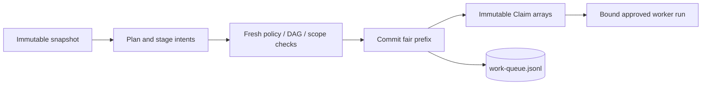
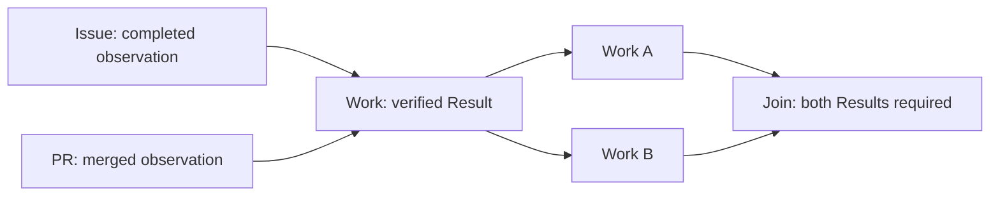

# Work Queue

Use the Git-backed queue for mandatory fair scheduling, immutable Work DAGs and
Claim-scoped worker effects. The only authority is the causal
`work-queue.jsonl` log. Defaults feel like FIFO: one priority, one accounting key,
and the oldest eligible Work next. Configured positive weights share durable
Claim opportunities, not CPU time or successful completions.

Issues and pull requests may be dependency nodes, not queue storage. The Issues
storage backend and old queue protocols are unsupported. For a lightweight
checklist, sub-issue, Discussion or cache-memory backlog, use
[WorkQueueOps](../../docs/src/content/docs/patterns/workqueue-ops.md); its progress
markers do not provide this protocol's authority or fairness guarantees.

See the [implementation coverage table](../../specs/work-queue/priority-and-fairness.md#91-implementation-coverage-and-remaining-requirements)
for incomplete validation and the explicitly deferred writer-restriction boundary.

## Read-only observers

A workflow that only reads queue snapshots is not a dispatcher or worker.
Observers expose read/explain tools and use normal configured authorization for
ordinary reports or `noop`; they cannot submit, dispatch or finish queue work.
Missing input must never downgrade a declared worker to observer mode.

The trusted compiler/runtime role channel establishes this distinction.
Snapshot metadata and agent-created intent files do not grant authority.
A genuinely absent queue may be reported as uninitialized; an existing empty,
malformed or unsupported ledger is an explicit failure, not an empty backlog.

## Dispatcher workflows

Enable `tools.work-queue` and use `work_queue_read` or `work_queue_explain` for
the immutable activation snapshot. Predictions may be stale; sorting only
changes presentation and cannot override policy.

Stage task plans with `work_queue_submit` and pool/budget requests with
`work_queue_dispatch_next`. Do not select the winning Work or target in a dispatch
intent. Trusted processing refreshes the authoritative prefix, selects according
to installed policy, and commits a compatible fair prefix atomically. A CAS loser
discards all tentative choices and charges before recomputing.



An unassigned dispatcher's queue-control path is not permission to emit arbitrary
resource-writing outputs. Ordinary non-queue dispatch remains separate. Agent
execution and snapshot MCP receive no queue-publication credentials.

## Minimal trusted deployment

Queue frontmatter is not an installation mechanism. The first Policy must be
installed explicitly by an authenticated administrator (or trusted host); this
is unsupported as automatic workflow bootstrap. A deployment needs three
separate pieces:

1. A trusted producer whose authenticated principal has an installed producer
   rule.
2. A dispatcher compiled with an allowlist of worker workflow names and a
   bounded dispatch budget.
3. An installed Policy binding each worker profile to its exact workflow path,
   immutable commit SHA, authenticated principal, trust domain and effect scope.

First publish and compile the worker and dispatcher workflows on the repository's
default branch. Configure the worker with a required assignment:

```yaml
tools:
  work-queue:
    storage: git
    require-assignment: true
    worker: true
```

Configure the dispatcher with only the worker names it may route to:

```yaml
tools:
  work-queue: true
safe-outputs:
  dispatch-workflow:
    workflows: [eslint-refiner]
    target-ref: ${{ github.event.repository.default_branch }}
    max: 3
  noop:
```

The workflow-name list is compiler approval, not dispatch authority by itself.
Queue dispatch uses the installed profile's immutable SHA and principal, not
the dispatcher's moving `target-ref`. Add only the worker routes required by
the pool. Do not give the dispatcher agent direct queue-branch write credentials.

Create a complete `QueuePolicy` JSON file from this template. Replace both actor
ID placeholders with verified positive decimal GitHub principal IDs, and replace
the SHA with the actual 40- or 64-character commit containing the worker
workflow. Add one producer entry per trusted submission identity; do not grant
producer entitlement merely because an identity is the administrator. The
producer ID must match the principal authenticated for its submission path. The
worker profile principal must match the identity proven by the configured
dispatch credential and worker-run authentication; do not guess it from a
display name or `github.actor`.

```json
{
  "mode": "weighted-priority",
  "class_weights": [8, 4, 2, 1, 1],
  "accounting_weights": { "": 1 },
  "producers": {
    "REPLACE_WITH_PRODUCER_ACTOR_ID": {
      "pools": ["default"],
      "priorities": [1, 2, 3, 4, 5],
      "fairness_keys": [""]
    }
  },
  "pools": {
    "default": {
      "default_profile": "eslint-refiner",
      "profiles": {
        "eslint-refiner": {
          "workflow": ".github/workflows/eslint-refiner.lock.yml",
          "ref": "REPLACE_WITH_40_OR_64_HEX_COMMIT_SHA",
          "principal": "REPLACE_WITH_WORKER_CREDENTIAL_ACTOR_ID",
          "trust_domain": "eslint-refiner",
          "credential_scope": "repository",
          "effect_scope": "github/gh-aw",
          "max_claims": 1,
          "share_keys": false
        }
      },
      "logical_limit": 16,
      "native_limit": 16,
      "allowed_repositories": ["github/gh-aw"],
      "max_observation_age_ms": 60000,
      "retry": { "max_attempts": 3, "backoff_ms": 1000 },
      "reconciliation": { "max_attempts": 5, "deadline_ms": 300000 }
    }
  },
  "limits": {
    "ledger_bytes": 67108864,
    "recovery_bytes": 16777216,
    "payload_bytes": 16384,
    "graph_nodes": 4096,
    "predecessors": 64,
    "pending_nodes": 4096,
    "operations": 256,
    "assignment_bytes": 49152,
    "result_bytes": 4096,
    "evidence_bytes": 1024,
    "observation_writes": 4096
  }
}
```

This template uses the default empty accounting key and the runtime's maximum
supported limits. The 64 MiB ordinary ledger budget and 16 MiB recovery reserve
are separate; 80 MiB is not an admissible ordinary ledger limit. Limits may be
lowered, not increased beyond the native bounds. Additional accounting keys
must retain `"": 1` and explicitly grant their producer entitlements.

Before installation, independently provision branch protections so only the
trusted operator/host can write the queue branch, force updates and deletion are
prevented, and workflow-agent credentials cannot bypass those rules. Automated
verification/provisioning of these restrictions is deferred; Policy installation
does not provide that safeguard. Using the default queue branch, install the
Policy once the worker route is active:

```bash
gh aw work-queue --repo github/gh-aw policy \
  --file queue-policy.json --epoch eslint-queue-v1
```

Inspect the queue with `gh aw work-queue --repo github/gh-aw state`, or use
`tui` for keyboard navigation and cursor-synchronized Work/Claim details.
The [current operator reference](../../specs/work-queue/README.md#current-operator-interface)
documents bounded JSON/ASCII views, exact bulk cancellation and available-Work
priority overrides. Operator cancellation is terminal for Work and does not
stop or release a native worker; reconcile its exact evidence separately.

Run this as an explicitly authenticated administrator with permission to update
the protected queue branch. Use `--branch QUEUE_BRANCH` before `policy` when
selecting a separately protected queue branch. Policy changes after initialization
require a quiescent queue. The command installs the Policy in the causal ledger;
frontmatter does not install or amend it.

The trusted producer may now stage `work_queue_submit` requests only within its
installed pools, priorities and accounting keys. The dispatcher requests a
bounded pool prefix with `work_queue_dispatch_next`; the scheduler chooses the
eligible Work and approved profile. The worker processes only the received
version-3 assignment's `claims` array and scopes every effect to its original
Claim handle. Use `gh aw work-queue --repo github/gh-aw replay --json` to inspect
the resulting queue state.

## Worker workflows

Declare the workflow as a queue worker. The compiler supplies reserved
`work_queue_assignment` and caller context; do not construct or override them.
The immutable assignment contains bounded Claims with canonical handles and their
stored plans. Trusted activation authenticates the actual run/workflow/revision;
an assignment input alone does not authorize effects. A rerun cannot inherit
attempt 1's authority.

Every safe output and finish intent belongs to one Claim. An originally
single-Claim assignment can omit the selector. For a multi-Claim assignment,
specify `claim_handle` on every message, even after all but one member has closed.
Malformed, null, foreign or conflicting selectors fail rather than being replaced.

Finish each member with `outcome: "completed"` or `"cancelled"`. Missing finish
does not authorize effects. Completed/cancelled/completed is a valid combination;
valid siblings settle independently. Batching defaults to one Claim and is
explicitly enabled only for compatible work with substantial reusable setup.

When the runtime advertises the `work-queue` CLI wrapper under `<mcp-clis>`, use
`work-queue work_queue_read '{}'` or
`work-queue work_queue_claim_finish '{"claim_handle":"h1","outcome":"completed"}'`.
For a sole Claim, `{"outcome":"completed"}` is sufficient. These are MCP
subcommands, not `gh aw work-queue` operator commands. Staged finish is an intent;
trusted processing publishes Completion before scoped effects and Result only
after delivery verification.

## Inspect and manage the queue with the CLI

`gh aw work-queue` and workflow runtime use the same closed QueueCommit contract
and scheduling rules. Their native implementations are checked against shared
independent fixtures. An explicitly selected queue branch remains a separate
authority; do not combine its entitlement or effect permissions with another.

Use `gh aw work-queue --repo owner/repo replay --json` for state and `stats` for
counts. Explain/trace distinguish requests, grants, bindings, delivery and blocked
reasons. `compact` canonicalizes complete commits without resetting FIFO
positions, debt or history.

Old records, automatic upgrades, explicit Work-selection Claims and scalar
assignments are unsupported. Quiesce old writers/workflows and preserve evidence
before explicit current-protocol deployment; readers do not reset or migrate an
old queue. Mutation permissions and trusted run evidence must be established
independently; an operator actor string is not worker authorization.

## Useful patterns

An Issue predecessor requires fresh completed-state evidence; a PR predecessor
requires actual merge evidence. These nodes consume no Claims. A Work successor
requires its own predecessor Results, not a batch-wide native conclusion.



Lost launch responses, cancelled dispatchers and elapsed deadlines do not prove
nonlaunch. Retain reservations until exact termination/nonlaunch evidence is
available. Completion with uncertain delivery does not rerun effects; bounded
verification yields Result or DeliveryFailure. Keep payloads bounded and free of
secrets, and use pause/drain controls for incompatible campaign revisions.

See the [work queue protocol and CLI reference](../../specs/work-queue/README.md) for exact command flags, storage formats, and current implementation boundaries.
