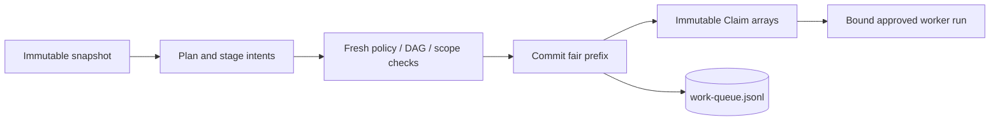
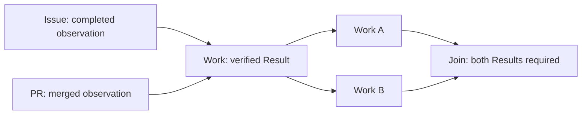

# Work Queue

Use the Git-backed queue for mandatory fair scheduling, immutable Work DAGs and
Claim-scoped worker effects. The only authority is the causal
`work-queue.jsonl` log. Defaults feel like FIFO: one priority, one accounting key,
and the oldest eligible Work next. Configured positive weights share durable
Claim opportunities, not CPU time or successful completions.

Issues and pull requests may be dependency nodes, not queue storage. The Issues
storage backend and old queue protocols are unsupported. For a lightweight
checklist, sub-issue, Discussion or cache-memory backlog, use
[WorkQueueOps](../../docs/src/content/docs/patterns/workqueue-ops.md); its progress
markers do not provide this protocol's authority or fairness guarantees.

See the [implementation coverage table](../../specs/work-queue/priority-and-fairness.md#91-implementation-coverage-and-remaining-requirements)
for incomplete validation and the explicitly deferred writer-restriction boundary.

## Read-only observers

A workflow that only reads queue snapshots is not a dispatcher or worker.
Observers expose read/explain tools and use normal configured authorization for
ordinary reports or `noop`; they cannot submit, dispatch or finish queue work.
Missing input must never downgrade a declared worker to observer mode.

The trusted compiler/runtime role channel establishes this distinction.
Snapshot metadata and agent-created intent files do not grant authority.
A genuinely absent queue may be reported as uninitialized; an existing empty,
malformed or unsupported ledger is an explicit failure, not an empty backlog.

## Dispatcher workflows

Enable `tools.work-queue` and use `work_queue_read` or `work_queue_explain` for
the immutable activation snapshot. Predictions may be stale; sorting only
changes presentation and cannot override policy.

Stage task plans with `work_queue_submit` and pool/budget requests with
`work_queue_dispatch_next`. Do not select the winning Work or target in a dispatch
intent. Trusted processing refreshes the authoritative prefix, selects according
to installed policy, and commits a compatible fair prefix atomically. A CAS loser
discards all tentative choices and charges before recomputing.

An unassigned dispatcher's queue-control path is not permission to emit arbitrary
resource-writing outputs. Ordinary non-queue dispatch remains separate. Agent
execution and snapshot MCP receive no queue-publication credentials.

## Worker workflows

Declare the workflow as a queue worker. The compiler supplies reserved
`work_queue_assignment` and caller context; do not construct or override them.
The immutable assignment contains bounded Claims with canonical handles and their
stored plans. Trusted activation authenticates the actual run/workflow/revision;
an assignment input alone does not authorize effects. A rerun cannot inherit
attempt 1's authority.

Every safe output and finish intent belongs to one Claim. An originally
single-Claim assignment can omit the selector. For a multi-Claim assignment,
specify `claim_handle` on every message, even after all but one member has closed.
Malformed, null, foreign or conflicting selectors fail rather than being replaced.

Finish each member with `outcome: "completed"` or `"cancelled"`. Missing finish
does not authorize effects. Completed/cancelled/completed is a valid combination;
valid siblings settle independently. Batching defaults to one Claim and is
explicitly enabled only for compatible work with substantial reusable setup.

When the runtime advertises the `work-queue` CLI wrapper under `<mcp-clis>`, use
`work-queue work_queue_read '{}'` or
`work-queue work_queue_claim_finish '{"claim_handle":"h1","outcome":"completed"}'`.
For a sole Claim, `{"outcome":"completed"}` is sufficient. These are MCP
subcommands, not `gh aw work-queue` operator commands. Staged finish is an intent;
trusted processing publishes Completion before scoped effects and Result only
after delivery verification.

## Inspect and manage the queue with the CLI

`gh aw work-queue` and workflow runtime use the same closed QueueCommit contract
and scheduling rules. Their native implementations are checked against shared
independent fixtures. An explicitly selected queue branch remains a separate
authority; do not combine its entitlement or effect permissions with another.

Use `gh aw work-queue --repo owner/repo replay --json` for state and `stats` for
counts. Explain/trace distinguish requests, grants, bindings, delivery and blocked
reasons. `compact` canonicalizes complete commits without resetting FIFO
positions, debt or history.

Old records, automatic upgrades, explicit Work-selection Claims and scalar
assignments are unsupported. Quiesce old writers/workflows and preserve evidence
before explicit current-protocol deployment; readers do not reset or migrate an
old queue. Mutation permissions and trusted run evidence must be established
independently; an operator actor string is not worker authorization.

## Useful patterns

An Issue predecessor requires fresh completed-state evidence; a PR predecessor
requires actual merge evidence. These nodes consume no Claims. A Work successor
requires its own predecessor Results, not a batch-wide native conclusion.

Lost launch responses, cancelled dispatchers and elapsed deadlines do not prove
nonlaunch. Retain reservations until exact termination/nonlaunch evidence is
available. Completion with uncertain delivery does not rerun effects; bounded
verification yields Result or DeliveryFailure. Keep payloads bounded and free of
secrets, and use pause/drain controls for incompatible campaign revisions.

See the [work queue protocol and CLI reference](../../specs/work-queue/README.md) for exact command flags, storage formats, and current implementation boundaries.
