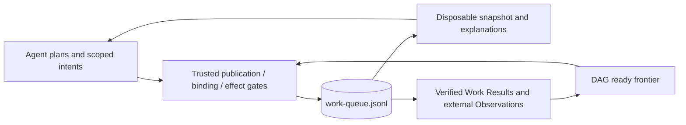

# ADR-64955: Git-Backed Work Queue Coordination

**Date**: 2026-10-02
**Status**: Draft
**Deciders**: gh-aw maintainers (review pending)

---

### Context

The [Work Queue proposal in issue #64852](https://github.com/github/gh-aw/issues/64852) needs a durable Work queue shared by independent dispatchers and worker workflows. Concurrent Claims, stale reads, workflow failures, and compaction must not produce conflicting terminal decisions or authorize losing workers' external effects. Agent execution can be duplicated, so admission checks alone cannot establish final ownership. The design should reuse repository storage and existing workflow job boundaries rather than require an external coordination service.

### Decision

Implement `tools.work-queue` as a first-class, compiler-aware tool backed by one
causal log, `work-queue.jsonl`, on a dedicated queue branch. Operators inspect and
update it with `gh aw work-queue`. The
[mandatory fair DAG protocol](../../specs/work-queue/priority-and-fairness.md)
replaces best-effort local selection and set-of-facts arbitration. Native Go and
JavaScript engines use one closed contract, the exact scheduling algorithm and
independent conformance fixtures. Each language reuses its engine across its
consumers.

Activation captures a disposable immutable snapshot; the MCP server reads it
without Git credentials and stages bounded intents. Trusted processing refreshes
the queue before publication, run binding or effects. Staging is never a durable
Claim, and a snapshot prediction never selects the authoritative Work.

#### Protocol commitments

| Boundary | Commitment |
|---|---|
| Replay | Reconstruct the unique QueueCommit chain and every operation prefix; reject malformed/forked/unauthorized history and nonconforming selection or packing. Physical record permutation/duplicate removal preserves that same chain. |
| Queue ordering | Mandatory priority/account fairness; causal-position FIFO within eligible buckets. Defaults are one class/key and FIFO. Charge one durable Claim, including each batched member and failed launch. |
| Dispatcher | Stage pool/budget intents, never select a preferred Work or invent Claim authority. Trusted CAS publication regenerates the complete fair packable prefix on a conflict. |
| Worker | Receive one immutable bounded `work_queue_assignment` array; default size one, larger compatible groups explicit. Authenticate the actual run and attempt independently. |
| External effects | Every safe output resolves to one Claim; only the original single-Claim assignment permits omitted selectors. Check binding, ownership, same-Claim Completion and resource scope before effects. Mixed outcomes settle independently. |
| Publication | Stable requests bind semantic meaning, not tentative winners or branch SHA. Checked Git publication and request recovery prevent duplicate charges after ambiguous acknowledgments. |
| DAG | Work predecessors require verified Results; typed Issue/PR vertices require fresh satisfying Observations. Completion or overall native success alone is insufficient. |
| Recovery | Fence one sender before dispatch. Retain uncertain reservations; release only on definitive nonlaunch or exact terminal evidence. Result/DeliveryFailure closes delivery without replaying completed effects. |
| Compaction | Canonicalize/deduplicate complete commits without changing causal positions, requests, charges, Results or history. No authoritative sidecar. |

The [formal verification notes and reproducible checker](../../specs/work-queue/README.md) document the invariants and assumptions. The bounded model checks support a parameterized inductive proof argument, not a mechanically checked unbounded proof or proof that a future runtime implementation refines the model.

Use `work-queue` for public names, branches, and artifact filenames, and
`work_queue` for AW context fields and MCP tool prefixes. The
[`transactions.tsp`](../../specs/work-queue/transactions.tsp) defines one current
contract for both surfaces. An explicitly configured branch remains a separate
authority; no reader silently combines queues.

The [current-only protocol decision](work-queue-protocol-upgrades.md) replaces
automatic upgrades and scalar-assignment compatibility. Existing old ledgers
fail unchanged; explicit deployment requires quiescence and preservation of old
evidence. Historical logs/audit decoding is diagnostic only.

The conclusion job writes a work queue activity step summary for workflows using `tools.work-queue`. It compares the activation snapshot with a read-only refresh of the durable queue, showing work and claim state counts, new transaction counts by kind, and the assigned worker's current state in a collapsed details section. These are shared-queue observations since activation, not activity attributed exclusively to the current run. Work, claim, and attempt identifiers are omitted. An unreadable snapshot or queue is reported as unavailable, not as an empty queue.

The [formal evidence](../../specs/work-queue/README.md) distinguishes bounded
models, witnesses, independent service properties and runtime conformance.
Unfinished searches are not passes. The
[implementation coverage table](../../specs/work-queue/priority-and-fairness.md#91-implementation-coverage-and-remaining-requirements)
tracks deferred writer-restriction enforcement and other unverified obligations.

### Alternatives Considered

#### Alternative 1: An External Transactional Queue or Database

An external service could provide efficient queue operations and atomic ownership changes without full-log replay or Git branch contention. It was not chosen because it would require operators to provision storage, credentials, and recovery infrastructure outside the repository. Repository-local durability and integration with existing trusted workflow boundaries are the primary drivers of this proposal.

#### Alternative 2: A Mutable Current-State Snapshot

A single projected-state file with version-checked updates would reduce read and replay costs and could enforce ownership through careful update rules. It was not chosen because it replaces explicit transaction history with a separate mutable-state reconciliation protocol. The append-only fact model makes arbitration, recovery, and compaction share one replay implementation and provides an inspectable transaction history.

### Consequences

#### Positive

- Durable coordination and an auditable history remain in the repository without an additional service.
- Shared replay, an immutable activation snapshot, and trusted publication boundaries give dispatchers, workers, recovery, and maintenance one consistent authority model.
- The executable model and explicit invariants provide a baseline for implementation and regression testing.

#### Negative

- Full-log reads and replay add latency; competing writers contend on one branch and may exhaust bounded retries.
- Duplicate-only compaction does not bound unique transaction growth or Git history size. More aggressive retention requires another equivalence proof.
- A crash after Completion can leave delivery uncertain. Conservative Result or
  DeliveryFailure recovery does not provide atomic or exactly-once external writes.
- Automated deployment enforcement of trusted queue-branch writers is deferred;
  operators must independently establish that security precondition.

#### Neutral

- Batching reduces reusable setup overhead, not Claim charges, and isolates
  authorization rather than agent memory/filesystem visibility.
- The guarantee is a single externally effective winner, not exactly-once agent execution or atomic external operation batches. Eventual progress also requires available workflows and successful retries.

---

*Draft decision record for [pull request #64955](https://github.com/github/gh-aw/pull/64955). Review before changing status to Accepted.*
