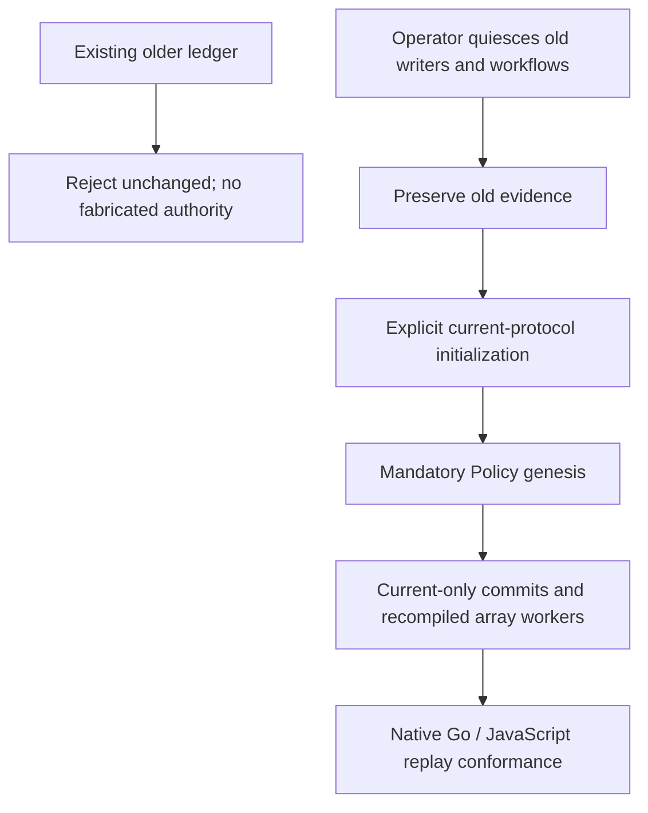

# Extension to ADR-64955: Current-Only Work Queue Commits

**Date**: 2026-10-02
**Status**: Draft
**Deciders**: gh-aw maintainers (review pending)

---

### Context

The [work queue ledger](64955-git-backed-work-queue-coordination.md) is durable.
The original workflow fact format and operator payload/provenance format cannot
express mandatory scheduling, shared native reservations, DAG barriers, or
authenticated per-Claim delivery. Fabricating these facts during a read would
invent policy, causal positions, accounting debt, and launch authority.

### Decision

Replace upgrade-on-load with one closed version-3 `QueueCommit` contract in
[`transactions.tsp`](../../specs/work-queue/transactions.tsp). Every authoritative
mutation uses the same causal `work-queue.jsonl` chain. Both native engines
validate the contract before replay/publication; neither accepts policy-less
facts, unversioned records, unknown versions, or automatic codemods.

The old unversioned/version-0/version-1/version-2 records remain unsupported
operational inputs. Rejection leaves the existing queue unchanged. Historical
logs/audit artifacts may be decoded as historical evidence, but that decoder
cannot grant authority, participate in current scheduling, or rewrite history.

Work FIFO positions come from the validated causal commit/operation order, not
client timestamps or physical line order. A mandatory Policy defines the epoch.
Stable logical requests bind meaning across CAS retries; retries regenerate
selection and packing rather than preserve a stale winner.

The compiler-managed input is `work_queue_assignment`: an immutable bounded
Claim array and shared dispatch/request provenance. Scalar `work_queue_claim`
and legacy context aliases are rejected. The actual run is authenticated and
bound independently; an assignment input is not proof of run authority.

This is a breaking deployment. Operators must quiesce old writers, resolve
in-flight work and native/delivery uncertainty, preserve old evidence, and
explicitly provision the new authority before resuming recompiled workflows.
No reader renames, copies, resets, or silently merges old branches.

### Alternatives Considered

#### Automatic fact upgrades

Rejected because old facts contain insufficient information to reconstruct
authoritative policy, fairness charges, verified Results, or native run binding.
An apparently successful upgrade could authorize effects without evidence.

#### A compatibility scheduling mode

Rejected because direct Claims or advisory FIFO would bypass mandatory
queue-wide fairness. Compatibility readers are limited to historical reporting.

### Consequences

#### Positive

- Queue readers never invent authority missing from older records.
- Runtime and operator tools use one wire contract and explicit causal evidence.

#### Negative

- Deployment requires explicit quiescence and operator handling of old history.
- Existing workflows, assignments and operator scripts must be updated together.

#### Neutral

- Native Go and JavaScript implementations remain separate, with generated
  schemas and strict independent conformance tests.
- Automated queue-writer restriction verification/provisioning is deferred by
  user direction. This ADR does not claim that deployment boundary is enforced.
