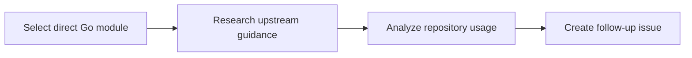

Go Fan is a weekday dependency-analysis workflow for Go repositories. On each run, it selects a direct dependency from `go.mod`, researches upstream changes and recommended usage, compares those findings with the repository's code, and creates a single issue containing actionable recommendations.

## How Go Fan selects modules

Go Fan tracks previously reviewed modules with `cache-memory`. It prioritizes recently updated GitHub-hosted dependencies, then cycles through the remaining direct dependencies. It avoids selecting a module reviewed in the last seven days unless every direct dependency is still within that review window, in which case it resets the list and starts from the top.

## What the workflow reports

The workflow saves a detailed module summary under `scratchpad/mods/` and creates a `[go-fan]` issue. The issue identifies current usage, relevant upstream changes, best-practice gaps, and prioritized opportunities for simplification, improved error handling, configuration, testing, or performance.

Review the recommendations before implementing them. For a structured handoff from research to planning, assignment, and human review, use the [ResearchPlanAssignOps pattern](/gh-aw/patterns/research-plan-assign-ops/).

## Workflow source

The active workflow runs on weekdays and can also be started manually:

- [Go Fan workflow source](https://github.com/github/gh-aw/blob/main/.github/workflows/go-fan.md)
- [Go Fan generated workflow](https://github.com/github/gh-aw/blob/main/.github/workflows/go-fan.lock.yml)

## Learn More

- [ResearchPlanAssignOps](/gh-aw/patterns/research-plan-assign-ops/)
- [Safe outputs](/gh-aw/reference/safe-outputs/)
- [Scheduled workflow triggers](/gh-aw/reference/triggers/#scheduled-triggers-schedule)
