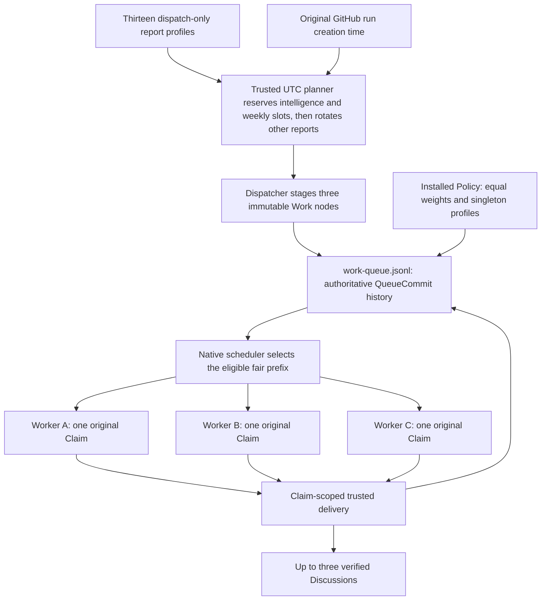
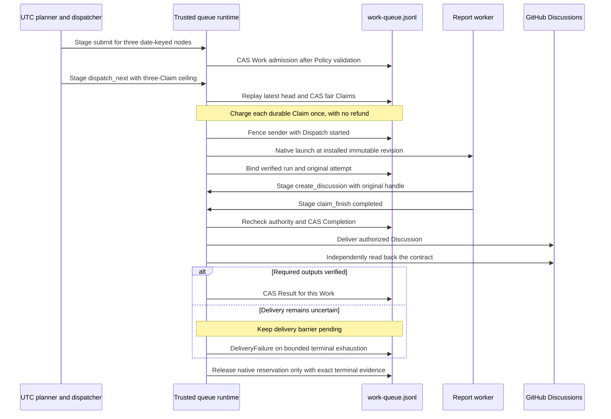
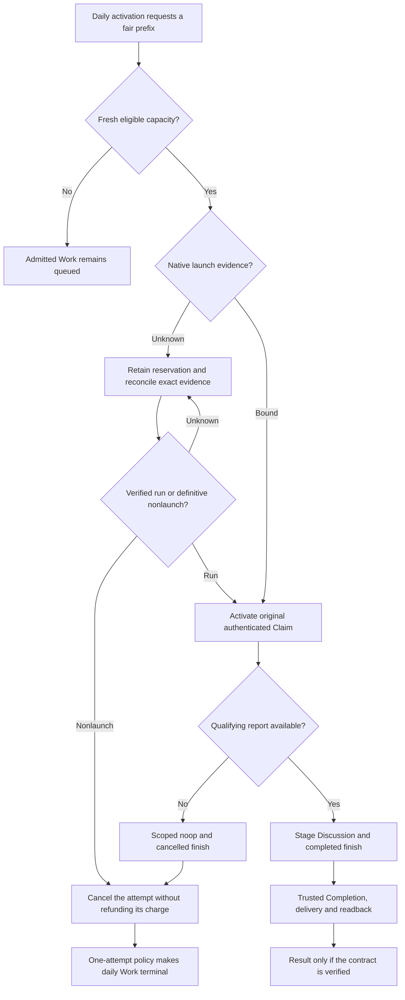

The daily report portfolio centralizes thirteen reporting workflows as
dispatch-only workers. One daily dispatcher admits three report profiles,
requests the queue's eligible fair prefix, and leaves publication to each
worker's existing mission. Reports are GitHub Discussions, not a second queue.

Like the [Linter Factory](/gh-aw/patterns/linter-factory/), this example uses
`tools.work-queue` and one authoritative `work-queue.jsonl` on the `work-queue`
branch. Work admission, scheduling decisions, Claims, launch bindings,
Completion and verified delivery share that transaction log.

> [!IMPORTANT]
> The sources are an orchestration example, not an already provisioned live
> deployment. Configure the complete compiler-approved Policy proposal,
> and verified immutable worker bindings before enabling a producer. Its first
> submission atomically bootstraps Policy and Work without administrator seeding.
> Compiling a workflow alone does not install Policy or launch workers.

## Thirteen reports, one dispatcher

| Worker source | Primary Discussion |
| --- | --- |
| [daily-compiler-quality](https://github.com/github/gh-aw/blob/main/.github/workflows/daily-compiler-quality.md) | Compiler quality and consistency |
| [daily-evals-report](https://github.com/github/gh-aw/blob/main/.github/workflows/daily-evals-report.md) | Evals adoption, pass rates and investigation steps |
| [daily-firewall-report](https://github.com/github/gh-aw/blob/main/.github/workflows/daily-firewall-report.md) | Firewall operation and charts |
| [daily-issues-report](https://github.com/github/gh-aw/blob/main/.github/workflows/daily-issues-report.md) | Issue activity and analysis |
| [daily-observability-report](https://github.com/github/gh-aw/blob/main/.github/workflows/daily-observability-report.md) | Workflow observability |
| [daily-regulatory](https://github.com/github/gh-aw/blob/main/.github/workflows/daily-regulatory.md) | Discussion/report compliance |
| [daily-repo-chronicle](https://github.com/github/gh-aw/blob/main/.github/workflows/daily-repo-chronicle.md) | Repository activity and trends |
| [daily-secrets-analysis](https://github.com/github/gh-aw/blob/main/.github/workflows/daily-secrets-analysis.md) | Secret-reference patterns, never secret values |
| [daily-team-evolution-insights](https://github.com/github/gh-aw/blob/main/.github/workflows/daily-team-evolution-insights.md) | Team evolution and collaboration |
| [daily-token-consumption-report](https://github.com/github/gh-aw/blob/main/.github/workflows/daily-token-consumption-report.md) | AI Credit consumption from telemetry |
| [deep-report](https://github.com/github/gh-aw/blob/main/.github/workflows/deep-report.md) | Daily intelligence synthesis of previously published reports, with bounded follow-up tasks |
| [artifacts-summary](https://github.com/github/gh-aw/blob/main/.github/workflows/artifacts-summary.md) | Artifact storage and retention; Sunday admission |
| [repo-tree-map](https://github.com/github/gh-aw/blob/main/.github/workflows/repo-tree-map.md) | Repository structure and sizes; Monday admission |

The [dispatcher source](https://github.com/github/gh-aw/blob/main/.github/workflows/daily-report-dispatcher.md)
has the only portfolio schedule. The workers keep their engines, read tools,
categories and report logic, but no longer have independent cron triggers.
Compiler-quality's issue fallback is disabled; evals and token-consumption
publish their primary reports as Discussions instead of issues.

DeepReport reserves one of the three slots every day, replacing its former
six-hour schedule. It synthesizes previously published reports within its
assigned seven-day window, not staged outputs from its current cohort. Its Work
is independent rather than a fan-in dependency: declined/no-data sibling reports
must not block intelligence reporting. Like every worker, daily admission does
not guarantee same-day publication when capacity is unavailable.

DeepReport retains up to seven deduplicated issue outputs, three comments and
three diagnostic artifacts, all declared in its Claim contract. Its historical
notes use cache-memory instead of unscoped writes to `memory/deep-report`.
Legacy Git memory is not automatically migrated; missing cache history is
reported as a limitation, and actual open issues remain the deduplication source.

The artifact and tree workers retain weekly admission, but share the dispatcher's
10:00 UTC schedule rather than their former 06:00/15:00 times. Their weekly slots
replace daily slots instead of increasing the three-node admission or launch
budget. Publication can be delayed by queue capacity. The tree report describes
the installed immutable worker revision's checkout, not a historical checkout
at `report_date`; that date identifies its reporting opportunity.

### Reports intentionally left on schedules

Discussion creation alone does not make a workflow a report-only worker.
The remaining scheduled discussion publishers retain their existing triggers:

| Workflows | Reason for keeping the independent schedule |
| --- | --- |
| `daily-news`, `daily-arxiv-researcher`, `constraint-solving-potd` | Weekday news, new-paper discovery and the daily problem depend on freshness |
| `daily-cache-strategy-analyzer`, `agent-performance-analyzer` | Remediation and shared history/coordination are part of the mission, not just reporting |
| `daily-hippo-learn` | Stateful learning and memory consolidation require their daily cycle |
| `org-health-report`, `portfolio-analyst` | Weekly organization-wide and 30-day financial reporting have distinct scope and cadence |
| `archivx-agentic-workflows-analyzer`, `workflow-skill-extractor`, `dataflow-pr-discussion-dataset` | Weekly diagrams, skill extraction and dataset generation produce additional durable effects |
| `firewall-escape`, `lint-monster`, `issue-arborist`, `auto-triage-issues` | Security tests, remediation, issue linking and triage must not become optional report opportunities |
| `smoke-copilot` and its ARM/AOAI variants | Scheduled engine checks publish discussions as test outputs |

Manual, command and PR-triggered discussion publishers also remain outside the
portfolio. Upstream-managed workflow sources are not edited.



The three admitted nodes are independent graph roots, not a chain or a
miner-to-refiner DAG. They share a date-keyed graph for identity and inspection;
one report does not wait for another report's Result.

## Admission rotation is not queue authority

The planner derives the previous complete UTC report date from the original
run's GitHub API `created_at`. For a scheduled activation on October 6, the
report date is October 5, and a one-day analysis window ends at midnight
October 6. Longer analysis windows retain the workflow's existing duration but
use that same immutable endpoint, even after a delayed launch.

The ten rotating profiles are ordered. The planner reserves a DeepReport slot
every day, an artifact slot for
Saturday report dates (Sunday activations), and a tree slot for Sunday report
dates (Monday activations). It fills the remaining one or two slots from the
daily rotation. Its starting index is `(UTC epoch day * 2 - prior weekly slots)
% 10`, so weekly slots never skip a daily profile. Every daily profile receives
six admissions in any thirty-five consecutive days; each weekly profile
receives five, and DeepReport receives thirty-five. These are admission
frequencies, not delivery guarantees.

```javascript title="actions/setup/js/daily_report_portfolio.cjs (rotation excerpt)"
reportsForDay("2026-10-05");
// team-evolution-insights, token-consumption, deep-report
reportsForDay("2026-10-10");
// team-evolution-insights, artifacts-summary, deep-report
reportsForDay("2026-10-11");
// token-consumption, repo-tree-map, deep-report
```

For report date `2026-10-05`, the admitted profiles are team-evolution-insights,
token-consumption and DeepReport. The same date, repository and numeric repository ID
produce the same graph, nodes and payloads. No mutable run ID is embedded in
those node definitions.

| Boundary | Meaning |
| --- | --- |
| Reserved intelligence/weekly slots and rotation | Which three report profiles receive new Work today |
| Priority `3` | All portfolio nodes enter the same priority class |
| Per-profile fairness key, weight `1` | Scheduling debt is accounted equally across profiles |
| `max_claims: 3`, `max_dispatches: 3` | Ceilings for the original daily activation, not guaranteed launches |
| Policy `logical_limit: 3`, `native_limit: 3` | At most three active reservations; not three per calendar day |
| Policy `max_attempts: 1` | A declined or failed daily report does not automatically consume another Claim attempt |

The native scheduler, not the planner or agent, selects eligible winners from
fresh queue state. Older admitted cohorts may win first. Pauses, retained
reservations and unavailable capacity can produce fewer than three launches.
Three launches do not guarantee three published Discussions.

There is one daily schedule, no manual-dispatch trigger, and a
`github.run_attempt == 1` gate. Whole-run reruns cannot admit another cohort.
This is **not a queue-enforced UTC-day quota**: adding another trigger or
dispatcher requires a new calendar-budget design.

## Dispatcher source and consuming prompt

The following source excerpt omits engine settings and the preparation step.
The dispatch allowlist approves routes; the compiler-approved Policy proposal
supplies actual immutable revisions, launch principals and resource scope.

```aw wrap title=".github/workflows/daily-report-dispatcher.md (excerpt)"
---
on:
  schedule: daily around 10:00
if: github.run_attempt == 1
tools:
  work-queue: true
  cli-proxy: true
  bash:
    - cat /tmp/gh-aw/agent/daily-report-plan.json
safe-outputs:
  dispatch-workflow:
    workflows:
      - daily-compiler-quality
      - daily-evals-report
      - daily-firewall-report
      - daily-issues-report
      - daily-observability-report
      - daily-regulatory
      - daily-repo-chronicle
      - daily-secrets-analysis
      - daily-team-evolution-insights
      - daily-token-consumption-report
      - deep-report
      - artifacts-summary
      - repo-tree-map
    target-ref: ${{ github.event.repository.default_branch }}
    max: 3
  noop:
---

Read /tmp/gh-aw/agent/daily-report-plan.json.
Call work_queue_read with {"pool":"daily-reports","limit":32}.
Call work_queue_submit once with {"nodes": <the exact plan.nodes array>}.
Call work_queue_dispatch_next once with the exact plan.dispatch:
{"pool":"daily-reports","max_claims":3,"max_dispatches":3}.
Do not select winning Work IDs, workflows or revisions from the snapshot.
Do not call ordinary dispatch_workflow or target-specific dispatch tools.
```

The trusted `actions/github-script` preparation step calls
`getWorkflowRun` and `repos.get`, then passes API-derived metadata to the
bounded plan builder:

```javascript title="Trusted preparation step (excerpt)"
const plan = buildDailyReportPlan({
  date: new Date(Date.parse(run.created_at) - 86400000)
    .toISOString().slice(0, 10),
  repository: repository.full_name,
  repositoryId: String(repository.id),
});
fs.writeFileSync(
  "/tmp/gh-aw/agent/daily-report-plan.json",
  JSON.stringify(plan)
);
```

The JSON file is a preparation artifact, not a second scheduler ledger. Its
selection becomes durable through normal Work admission. Queue snapshots are
read-only views and never grants.

### MCP read, submit and request

These objects are individual MCP `tools/call` parameters on the `work-queue`
server, not operator CLI commands:

```json
{"name":"work_queue_read","arguments":{"pool":"daily-reports","limit":32}}
```

The submit call contains all three complete generated nodes. This JavaScript
excerpt shows the argument shape without repeating their shared contracts:

```javascript title="MCP tools/call parameters constructed from the prepared plan"
const submitCall = {
  name: "work_queue_submit",
  arguments: { nodes: plan.nodes },
};
const dispatchCall = {
  name: "work_queue_dispatch_next",
  arguments: {
    pool: "daily-reports",
    max_claims: 3,
    max_dispatches: 3,
  },
};
```

One node in that submission has the following shape. The repository identities
are illustrative; production identities come from the trusted API lookup.
Optional diagnostic output allowances are omitted from this excerpt.

```json wrap title="One of the three admitted Work nodes (excerpt)"
{
  "graph_id": "daily-report-cohort:2026-10-05",
  "node_key": "daily-token-consumption-report",
  "pool": "daily-reports",
  "priority": 3,
  "fairness_key": "daily-token-consumption-report",
  "worker_profile": "daily-token-consumption-report",
  "payload": {
    "plan": "Run this workflow's existing discussion-report mission for the immutable report date. Publish at most one discussion; do not dispatch other reports.",
    "report_date": "2026-10-05",
    "report_profile": "daily-token-consumption-report",
    "resource_scope": {
      "version": 1,
      "resources": [
        {"host":"github.com","repository":"owner/repo","repository_id":"7"}
      ]
    },
    "effect_contract": {
      "version": 1,
      "outputs": [{"type":"create_discussion","min":1,"max":1}]
    }
  },
  "depends_on": []
}
```

Work ID is derived from `graph_id` and `node_key`; it is not a caller-selected
task name. An identical submission reuses the stored definition and enqueue
position. A changed payload under that identity is a conflict, not an update.

Both queue writes initially return a staging acknowledgement:

```json
{"intent_id":"intent:example","status":"staged"}
```

That response is neither a Claim nor proof of a native launch. Trusted
processing replays the current ledger, validates entitlements and publishes
accepted operations using compare-and-swap.

## Worker source, assignment and publication

Each worker declares its role directly so compiler target validation can
recognize it. The shared import supplies the common consuming prompt and
no-data behavior.

```aw wrap title=".github/workflows/daily-compiler-quality.md (excerpt)"
---
on:
  workflow_dispatch: null
imports:
  - shared/daily-report-worker.md
tools:
  work-queue:
    worker: true
    require-assignment: true
safe-outputs:
  create-discussion:
    category: audits
    title-prefix: "[daily-compiler-quality] "
    max: 1
    min-body-length: 200
    fallback-to-issue: false
---

Require exactly one original work_queue_assignment Claim.
Use that member's work.report_profile and work.report_date.
Stage at most one discussion with its original handle as claim_handle.
After the discussion and declared charts, finish that Claim as completed.
If no qualifying report can be prepared, stage a scoped noop or
report_incomplete and finish the Claim as cancelled instead.
```

The [complete shared prompt](https://github.com/github/gh-aw/blob/main/.github/workflows/shared/daily-report-worker.md)
also requires profile/date validation, immutable report windows, scoped
outputs and treatment of source text as untrusted data. The compiler adds the
reserved `work_queue_assignment` string input and authenticated activation;
authors do not declare or construct it.

### What crosses `workflow_dispatch`

The protected publisher sends a canonical JSON **string**, not nested input
objects or a hand-authored Claim. Its native request includes these fields:

```javascript title="Protected native dispatch fields (excerpt)"
{
  workflow_id: profile.workflow,
  ref: profile.ref,
  inputs: { work_queue_assignment: canonical(assignment) }
}
```

`profile.ref` is the installed immutable revision, not an agent-selected branch.
The original decoded assignment contains one member:

```json wrap title="Illustrative singleton assignment (excerpt)"
{
  "version": 3,
  "dispatch_id": "d_example",
  "request_id": "request:example",
  "commit_id": "commit:example",
  "policy_epoch": "daily-reports-v1",
  "pool": "daily-reports",
  "worker_profile": "daily-token-consumption-report",
  "claims": [
    {
      "handle": "h1",
      "claim_id": "c_example",
      "work_id": "GENERATED_WORK_ID",
      "work": {
        "report_date": "2026-10-05",
        "report_profile": "daily-token-consumption-report"
      },
      "result_refs": []
    }
  ]
}
```

The displayed `work` omits the plan, repository scope and output contract for
brevity; the real assignment retains the **entire exact admitted payload**.
IDs are illustrative, not an authenticated grant. Copying this JSON or
manually dispatching a worker does not authorize effects.

### Stage a Discussion, then finish the original Claim

The output call belongs to `safeoutputs`; finish belongs to `work-queue`.
The following array groups separate calls for display:

```json wrap
[
  {
    "name": "create_discussion",
    "arguments": {
      "claim_handle": "h1",
      "title": "[token-consumption] Daily AIC Consumption Report - 2026-10-05",
      "body": "The evidence-backed report body, including its UTC window, metrics, source references and any telemetry limitations."
    }
  },
  {
    "name": "work_queue_claim_finish",
    "arguments": {"claim_handle":"h1","outcome":"completed"}
  }
]
```

Copy `handle`, not `claim_id` or `work_id`. Explicit handles keep the scope
visible even though original singleton assignments may omit the selector.
Do not send an empty, whitespace, null or foreign selector to request inference.
If a future policy permits multiple original Claims, every output and finish
needs that member's explicit original selector, even after siblings close.

For a no-data report, stage `noop` with the same handle and finish with
`outcome: "cancelled"`. The contract requires a Discussion, so a no-op does not
count as successful delivery. Firewall and chronicle Work additionally permit
up to three declared assets; regulatory Work permits its configured bounded
Discussion-close output. Undeclared auxiliary writes remain unauthorized.
DeepReport Work additionally permits up to seven issues, three comments and
three artifacts; none substitutes for the required intelligence Discussion.

## One ledger from admission to verified Result

Agent calls stage intents. The trusted publisher owns the following ledger
transitions; none can be manufactured by a report worker:



| Ledger operation | What it establishes |
| --- | --- |
| `Policy` | Entitlements, approved immutable profiles, capacities and retry bounds |
| `Work` | One immutable date/profile node and its effect contract |
| `Claim` | A durable scheduled attempt and fairness charge |
| `Dispatch` | Sender fencing, assignment and verified native run binding |
| `Completion` | A scoped completed intent accepted by trusted processing |
| `Result` | Required output cardinality and independently verified delivery |
| `ClaimCancellation`, `WorkCancellation` | Declined/failed attempt and terminal Work when its one-attempt budget is exhausted |
| `Release` | Capacity release justified by exact native terminal or definitive nonlaunch evidence |

Completion is not Result. An API success response or a native run's success
conclusion is also not proof that the required Discussion exists.

## Claim diagnostic artifacts

Worker diagnostics live under `/tmp/gh-aw/claims/<original-identity-hash>/`.
They are audit exports, not scheduling authority or proof of Result.

| File | Purpose |
| --- | --- |
| `safe-output-items.jsonl` | Executed resource operations and their original Claim attribution |
| `temporary-id-map.json` | Symbolic-to-resource references for auditing; runtime resolution uses the unchanged in-memory map |
| `safe-output-errors.json` | Structured failure diagnostics, not raw handler stdout/stderr |

The redundant `delivery-receipt.json` is not written or uploaded. Independent
verification uses protected in-memory evidence, and outcomes belong in
`work-queue.jsonl`, not a diagnostic receipt.

Claim directories and files use modes `0700` and `0600`. Writers redact available
configured secrets, gateway tokens and built-in credential patterns from decoded
JSON keys and values before serialization. After delivery verification, the
existing redactor applies the worker job's configured secrets and any recoverable
agent-log runtime masks. Upload requires successful redaction and defaults to
one-day retention; `GH_AW_DEFAULT_ARTIFACT_RETENTION_DAYS` can override that
repository-wide default. Ordinary workflows and queue observers gain no Claim
paths or extra redaction step.

Redaction does not anonymize repository names, resource IDs or URLs, and cannot
identify arbitrary personal data or unknown secrets. Opaque runtime masks
registered only in the safe-output job are not recovered from agent logs. Avoid
putting such data in diagnostics; restrict artifact access accordingly.

## No data, backlog and uncertain launches

The reporting count is an operating target, never a reason to bypass queue
authority or release an unknown native launch:



An unknown launch keeps its reservation even when today's other reports cannot
start. Operator cancellation does not stop a native run or refund Claim debt.
A failed required Discussion does not become an issue fallback or an invented
successful no-write Result.

## Provision and inspect the example

Deploy the compiled worker sources and matching setup runtime on the default
branch. Independently verify the deployed immutable revision, numeric producer
principal and native launch principal. The
[policy generator](https://github.com/github/gh-aw/blob/main/actions/setup/js/daily_report_portfolio.cjs)
validates a dedicated portfolio policy from those explicit values:

```bash
node actions/setup/js/daily_report_portfolio.cjs policy \
  OWNER/REPO IMMUTABLE_SHA VERIFIED_PRODUCER_ID VERIFIED_WORKER_ID \
  > daily-report-policy.json
```

The generator does not verify identities against GitHub or install anything.
Represent the proposal in the dispatcher's compiler-approved configuration.
On an absent queue, its first authorized `work_queue_submit` publishes Policy
and the daily cohort together. No administrator-seeding command or separate
queue authentication step is supported.

If the queue already serves other workflows, merge the portfolio pool,
accounting keys and producer entitlements into its complete Policy. Preserve
other pools and limits, and quiesce before a later `policy` update. Never
overwrite a shared queue with the dedicated example Policy.

When expanding an already installed ten-profile portfolio, pause admission and
drain its original Claims before installing a new Policy epoch with all thirteen
profiles and the new verified immutable revisions. Existing Work definitions
are immutable: do not resubmit an already admitted date with the new rotation.
Resume on a report date that has not been admitted under the old planner.

The example bounds pending nodes to thirty. An extended backlog becomes an
explicit admission failure rather than an unbounded hidden schedule.

```bash
gh aw work-queue --repo OWNER/REPO state
gh aw work-queue --repo OWNER/REPO tui
gh aw work-queue --repo OWNER/REPO replay --json
```

The state/forest and master-detail TUI expose admitted Work and original
Claims; replay exposes their causal history. See the
[operator reference](/gh-aw/reference/work-queue/#operator-commands)
for exact cancellation selectors and reconciliation controls.

## Common pitfalls

| Pitfall | Correct boundary |
| --- | --- |
| Treating a three-item plan as three grants | Native scheduling uses fresh state and can grant fewer |
| Calling ordinary dispatch tools | Use one bounded `work_queue_dispatch_next`; approved routes do not grant Claims |
| Using the wall clock on a delayed worker | Read the immutable `work.report_date` and anchor its analysis window |
| Reusing a date/node identity with different content | Duplicate admission must preserve the entire payload |
| Counting a no-op or Completion as a delivered report | A required Discussion needs independent verification before Result |
| Publishing an undeclared issue, memory update or asset | Every effect needs the same Claim's immutable output and resource authority |
| Releasing an ambiguous launch to reach three reports | Retain its reservation until exact native evidence permits release |
| Treating `native_limit: 3` as a daily quota | It bounds concurrent reservations, not UTC-day launches |

The [Linter Factory](/gh-aw/patterns/linter-factory/) covers compatible
multi-Claim batching, mixed outcomes and immutable memory snapshots. This
portfolio deliberately uses singleton profiles and no report-to-report
dependencies to make admission rotation and publication authority distinct.
