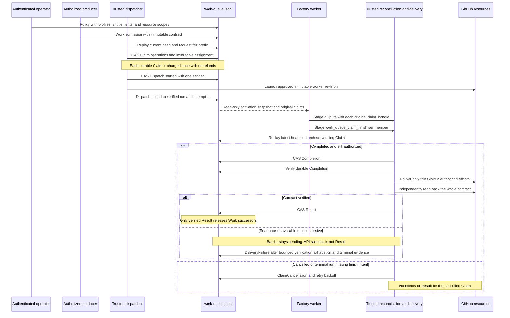
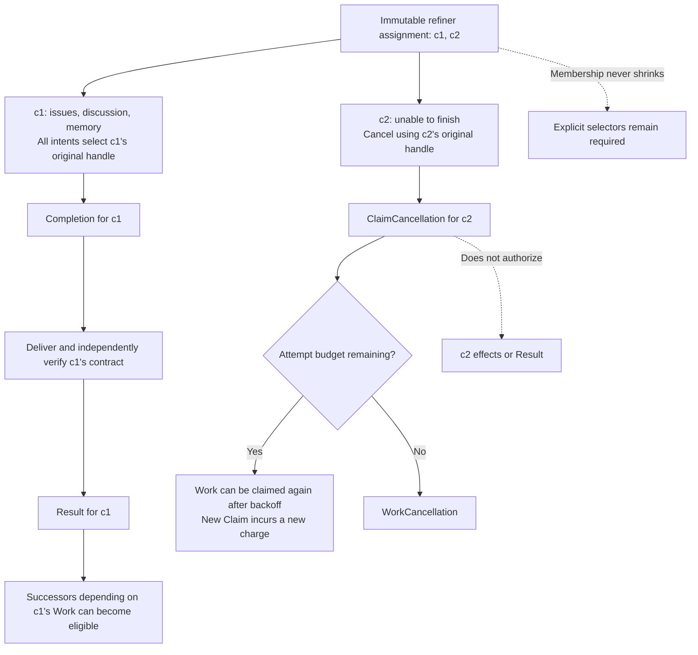
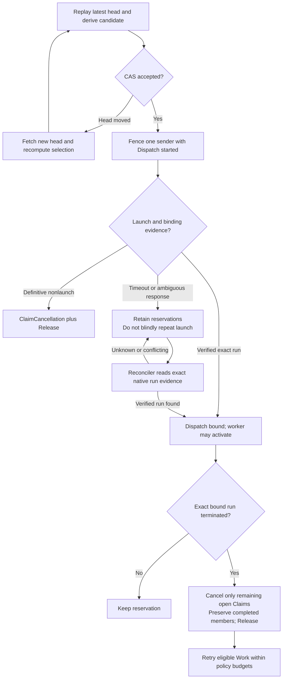

The ESLint factory is an example of the `tools.work-queue` feature. Its
dispatcher requests eligible work for three worker profiles; each worker
processes an authenticated assignment and attributes its outputs to the
original Claim.

Unlike the lightweight [WorkQueueOps](/gh-aw/patterns/workqueue-ops/) patterns,
this example uses one authoritative `work-queue.jsonl` transaction log on the
`work-queue` branch. Scheduling decisions, Claims, run bindings, Completion,
delivery outcomes, and recovery operations share that log. Issues, pull
requests, and refiner memory are output resources, not alternative queue
ledgers.

## Factory roles

| Workflow | Assigned work | Intended outputs |
| --- | --- | --- |
| [Dispatcher](https://github.com/github/gh-aw/blob/main/.github/workflows/eslint-factory-dispatcher.md) | Request a fair prefix within the installed pool policy | Launch approved worker profiles; no eligible work produces `noop` |
| [Miner](https://github.com/github/gh-aw/blob/main/.github/workflows/eslint-miner.md) | Find and implement a useful new ESLint rule | At most one draft rule PR per Claim, or `noop` |
| [Refiner](https://github.com/github/gh-aw/blob/main/.github/workflows/eslint-refiner.md) | Identify false positives, missing edge cases, or weak diagnostics | Up to three issues, a discussion, and one immutable memory snapshot per Claim |
| [Monster](https://github.com/github/gh-aw/blob/main/.github/workflows/eslint-monster.md) | Group actionable diagnostics and arrange remediation | Issue updates, Copilot assignments, and a discussion, or `noop` after a clean scan |

An authenticated operator must first install Policy, producer entitlements,
worker profiles, immutable workflow revisions, and resource scopes. An
authorized producer explicitly admits Work with its output contract. The
supplied workflows do **not** automatically create a miner-to-refiner-to-monster
DAG, and creating a refinement issue does not submit another Work.

The dispatcher requests
`work_queue_dispatch_next({"pool":"default","max_claims":3,"max_dispatches":3})`.
Those are request ceilings, not guaranteed assignments. The scheduler chooses
the fair eligible prefix; it stops at the first winner it cannot pack. Different
worker profiles use separate dispatches. A profile permits singleton
assignments by default; compatible multi-Claim batches require explicit policy.

## Ledger lifecycle

The sequence shows a successful launch and the per-Claim completion alternatives.
Every ledger write is a version-3 `QueueCommit` published with compare-and-swap
(CAS); the labels below name its operations. Agent tool calls stage intents,
not authoritative records.

For the refiner, the verified contract can include issues, a discussion, and the
exact memory commit, tree, blobs, and Claim ref. New snapshots live under
`memory/eslint-refiner-runs/claims/<trusted-namespace>`; the legacy
`memory/eslint-refiner` history is preserved. Both are restored read-only and
cannot grant Claim authority.

A `noop` or an empty output batch is not automatically a verified success.
The installed Work contract must permit the no-write outcome; required output
minimums and independent verification still apply.

## Singleton and mixed-Claim outcomes

Batching shares a worker run, not completion or output authority. In this
example, a refiner receives original assignment `[c1,c2]`. Cancelling `c2` does
not shrink that assignment or make `c1` an implicit singleton.

The originally singleton case may omit `claim_handle`. An original multi-Claim
assignment always needs an explicit original handle, even when only one member
remains unfinished. Counts are checked per Claim and output family: one
member's unused issue allowance cannot subsidize another member's overflow.

## Contention and interrupted launches

Recovery records its decisions in the same ledger. A stale snapshot is never
authority to publish a previously selected batch or release a reservation.

An accepted request replay returns its original outcome; it does not perform
another selection or charge existing Claims again. A crash after Completion
but before effects leaves a delivery barrier to reconcile, not permission to
replay completed effects blindly. This feature does not make external writes
atomic or exactly-once.

## Common pitfalls

| Pitfall | Required distinction |
| --- | --- |
| Treat a rule PR or refinement issue as the next queued task | Output creation is not Work admission. An authorized producer must explicitly install any DAG; Work edges wait for verified Result, and Issue/PR edges need fresh typed observations |
| Treat the activation snapshot, memory, or task text as authorization | Trusted reconciliation replays the latest ledger and validates the original Claim, profile, principal, resource scope, and actual run/attempt |
| Treat finish intent, Completion, job success, or an API response as delivered work | Completion precedes effects; Result requires independent verification of the whole immutable output contract |
| Retry a timed-out launch or release its Claims on elapsed time alone | Keep uncertainty conservative; require definitive nonlaunch or exact bound-run termination evidence |
| Reuse one handle or aggregate all output allowances across a batch | Use each member's original handle and enforce per-Claim counts; original membership never shrinks |
| Treat monster's clean flag as proof of zero diagnostics | ESLint exit zero includes warning-only results. Installation/build/tool failure is not a clean scan |
| Treat prompt quality requirements as ledger guarantees | Rule quality, nonduplicate findings, and the monster's three-total-remediation-assignments instruction are prompt obligations, not a global runtime quota or proof of successful remediation |
| Assume this example installs deployment security | This example does not provision queue-branch writer restrictions; protected credentials and writer enforcement must be installed independently |

See the [queue specification](https://github.com/github/gh-aw/blob/main/specs/work-queue/priority-and-fairness.md#91-implementation-coverage-and-remaining-requirements)
for coverage and remaining deployment/host requirements, and the
[bounded factory model](https://github.com/github/gh-aw/blob/main/specs/eslint-factory/README.md)
for independently checked scenarios and explicit abstraction limits.
