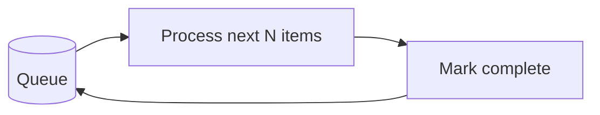
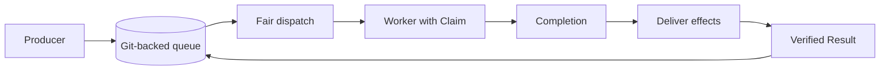
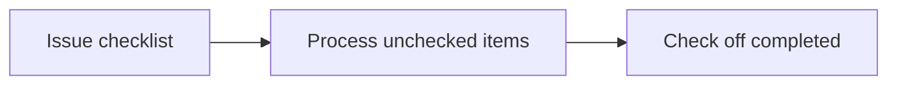

WorkQueueOps is a pattern for processing a backlog incrementally across workflow runs. The native `tools.work-queue` feature provides a Git-backed queue with fair scheduling, task dependencies, and Claim-scoped effects. An issue checklist is a lightweight alternative for small, human-managed batches.

| Approach | Choose it when |
| --- | --- |
| Native work queue | Multiple workers need fair scheduling, verified dependencies, and authorization for each task attempt. |
| Issue checklist | A small backlog needs visible progress without deploying a native queue. |



## Native Work Queue

The native queue stores immutable tasks and lifecycle events in `work-queue.jsonl` on a dedicated Git branch. A trusted producer submits tasks, a dispatcher requests assignments, and workers process them. The scheduler selects eligible tasks under an administrator-installed Policy; the agent does not choose which task receives a Claim.

A Claim authorizes one attempt at a task. Workers stage safe outputs and a finish intent for each original Claim. Trusted processing records Completion before authorizing those effects and records Result only after independently verified delivery. Dependent tasks wait for their predecessors' Results, not merely for a worker run to finish.

Declare the feature in dispatcher frontmatter:

```yaml title="Dispatcher frontmatter"
tools:
  work-queue: true
```

Workers must require an assignment:

```yaml title="Worker frontmatter"
tools:
  work-queue:
    storage: git
    require-assignment: true
    worker: true
```

These declarations are only part of deployment. Configure approved worker routes, producer permissions, capacity limits, and queue-branch writer restrictions using the [work-queue deployment guide](/gh-aw/guides/deploy-work-queue/). Frontmatter does not install Policy or protect the queue branch, and automated enforcement of writer restrictions remains deferred.



Native `tools.work-queue` supports Git storage only. Issues and pull requests can be dependency nodes, but they are not queue-storage backends. Use the [operator reference](/gh-aw/reference/work-queue/) to inspect and recover queue state, and the [protocol specification](/gh-aw/specs/work-queue-specification/) for implementation coverage and remaining security requirements. The [Linter Factory](/gh-aw/patterns/linter-factory/) shows dispatcher and worker workflows with Claim-scoped outputs.

## Alternative: Issue Checklist

Use GitHub issue checkboxes as a lightweight, human-readable queue. The agent reads the issue body, finds unchecked items, processes each one, and checks it off. Best for small-to-medium batches (< 100 items). Use [Concurrency](/gh-aw/reference/concurrency/) controls to prevent race conditions between parallel runs.

```aw wrap
---
on:
  workflow_dispatch:
    inputs:
      queue_issue:
        description: "Issue number containing the checklist queue"
        required: true

tools:
  github:
    toolsets: [issues]

safe-outputs:
  update-issue:
    body: true
  add-comment:
    max: 1
  close-issue:
    max: 1

concurrency:
  group: workqueue-${{ inputs.queue_issue }}
  cancel-in-progress: false
---

# Checklist Queue Processor

You are processing a work queue stored as checkboxes in issue #${{ inputs.queue_issue }}.

1. Read issue #${{ inputs.queue_issue }} and find all unchecked items (`- [ ]`).
2. For each unchecked item (at most 10 per run): perform the required work, then edit the issue body to change `- [ ]` to `- [x]`.
3. Add a comment summarizing what was completed and what remains.
4. If all items are checked, close the issue with a summary comment.
```



Checklist progress markers do not provide native fair scheduling, Claim authority, or verified dependency graphs. The concurrency group serializes runs in that group, but does not protect against other workflows or humans editing the issue.

## Idempotency and Concurrency

All WorkQueueOps patterns should be **idempotent**: running the same item twice should not cause double processing.

| Technique | How |
|-----------|-----|
| Check before acting | Query current state (label present? comment exists?) before making changes |
| Atomic state updates | Write queue state in a single step; avoid partial updates |
| Concurrency groups | Use `concurrency.group` with `cancel-in-progress: false` to prevent parallel runs |
| Retry budgets | Track failed items separately; set a retry limit before giving up |

## Learn More

- [BatchOps](/gh-aw/patterns/batch-ops/) — Process large volumes in parallel chunks rather than sequentially
- [ResearchPlanAssignOps](/gh-aw/patterns/research-plan-assign-ops/) — Research → Plan → Assign pattern for developer-supervised work
- [Work queues](/gh-aw/reference/work-queue/) — Native queue roles, Claim-scoped effects, and operator commands
- [Deploy a work queue](/gh-aw/guides/deploy-work-queue/) — Configure native producers, dispatchers, workers, and Policy
- [Concurrency](/gh-aw/reference/concurrency/) — Prevent race conditions in queue-based workflows
