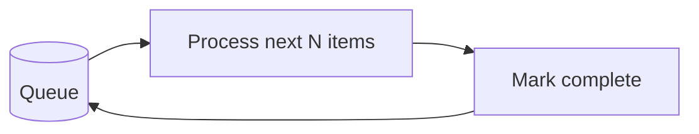
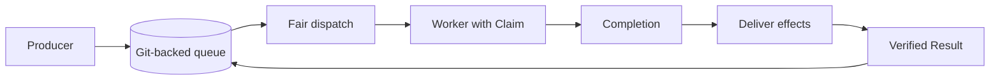
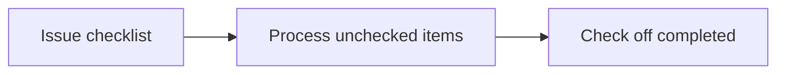

WorkQueueOps is a pattern for processing a backlog incrementally across workflow runs. The native `tools.work-queue` feature provides a Git-backed queue with fair scheduling, task dependencies, and Claim-scoped effects. Issue checklists, sub-issues, cache-memory, and repo-memory are lightweight alternatives when simple progress tracking is enough.

| Approach | Choose it when |
| --- | --- |
| Native work queue | Multiple workers need fair scheduling, verified dependencies, and authorization for each task attempt. |
| Issue checklist | A small backlog needs visible progress without deploying a native queue. |
| Sub-issues | Each work item needs its own discussion, assignee, and completion status under a parent tracking issue. |
| Cache-memory | A short-lived, branch-local backlog can be reconstructed if the cache is evicted. |
| Repo-memory | A file-based backlog needs Git history and persistence shared across workflow branches. |



## Native Work Queue

The native queue stores immutable tasks and lifecycle events in `work-queue.jsonl` on a dedicated Git branch. A trusted producer submits tasks, a dispatcher requests assignments, and workers process them. The scheduler selects eligible tasks under an administrator-installed Policy; the agent does not choose which task receives a Claim.

A Claim authorizes one attempt at a task. Workers stage safe outputs and a finish intent for each original Claim. Trusted processing records Completion before authorizing those effects and records Result only after independently verified delivery. Dependent tasks wait for their predecessors' Results, not merely for a worker run to finish.

Declare the feature in dispatcher frontmatter:

```yaml title="Dispatcher frontmatter"
tools:
  work-queue: true
```

Workers must require an assignment:

```yaml title="Worker frontmatter"
tools:
  work-queue:
    storage: git
    require-assignment: true
    worker: true
```

These declarations are only part of deployment. Configure approved worker routes, producer permissions, capacity limits, and queue-branch writer restrictions using the [work-queue deployment guide](/gh-aw/guides/deploy-work-queue/). Frontmatter does not install Policy or protect the queue branch, and automated enforcement of writer restrictions remains deferred.



Native `tools.work-queue` supports Git storage only. Issues and pull requests can be dependency nodes, but they are not queue-storage backends. Use the [operator reference](/gh-aw/reference/work-queue/) to inspect and recover queue state, and the [protocol specification](/gh-aw/specs/work-queue-specification/) for implementation coverage and remaining security requirements. The [Linter Factory](/gh-aw/patterns/linter-factory/) shows dispatcher and worker workflows with Claim-scoped outputs.

## Alternative: Issue Checklist

Use GitHub issue checkboxes as a lightweight, human-readable queue. The agent reads the issue body, finds unchecked items, processes each one, and checks it off. Best for small-to-medium batches (< 100 items). Use [Concurrency](/gh-aw/reference/concurrency/) controls to prevent race conditions between parallel runs.

```aw wrap
---
on:
  workflow_dispatch:
    inputs:
      queue_issue:
        description: "Issue number containing the checklist queue"
        required: true

tools:
  github:
    toolsets: [issues]

safe-outputs:
  update-issue:
    body: true
  add-comment:
    max: 1
  close-issue:
    max: 1

concurrency:
  group: workqueue-${{ inputs.queue_issue }}
  cancel-in-progress: false
---

# Checklist Queue Processor

You are processing a work queue stored as checkboxes in issue #${{ inputs.queue_issue }}.

1. Read issue #${{ inputs.queue_issue }} and find all unchecked items (`- [ ]`).
2. For each unchecked item (at most 10 per run): perform the required work, then edit the issue body to change `- [ ]` to `- [x]`.
3. Add a comment summarizing what was completed and what remains.
4. If all items are checked, close the issue with a summary comment.
```



Checklist progress markers do not provide native fair scheduling, Claim authority, or verified dependency graphs. The concurrency group serializes runs in that group, but does not protect against other workflows or humans editing the issue.

## Alternative: Sub-Issues

Create one sub-issue per work item under a parent tracking issue. Open sub-issues are pending work; closing a sub-issue marks that item complete. This keeps individual discussions, assignees, and results separate while the parent provides a backlog overview.

Use the GitHub `issues` toolset to read the parent's sub-issues and safe outputs to report and close completed items:

```yaml title="Sub-issue queue frontmatter"
tools:
  github:
    toolsets: [issues]

safe-outputs:
  add-comment:
    max: 6
  close-issue:
    max: 5

concurrency:
  group: sub-issue-queue
  cancel-in-progress: false
```

Each run lists all pages of the parent's open sub-issues, processes at most five, and adds a result comment before closing each successfully completed item. Leave failed items open with an explanation, then add one progress comment on the parent. Use a shared concurrency group for workflows processing the same parent and check for existing results before retrying work.

Sub-issue relationships organize the backlog; they do not enforce processing order, verified dependencies, or Claim-scoped authorization. Other workflows and human edits remain outside the concurrency group's protection.

## Alternative: Cache-Memory

Enable [cache-memory](/gh-aw/reference/cache-memory/) and store a small JSON queue at `/tmp/gh-aw/cache-memory/workqueue.json`:

```yaml title="Cache-memory frontmatter"
tools:
  cache-memory: true
```

```json title="workqueue.json"
{
  "pending": ["item-1", "item-2"],
  "completed": ["item-0"],
  "failed": []
}
```

Each run loads the file, processes a bounded batch of pending items, and moves them to `completed` or `failed` before saving the updated file. The compiler restores and saves the cache automatically. Serialize runs that update the same queue and check whether an item's effects already exist before retrying it.

Cache-memory is branch-scoped and unused caches can be evicted after seven days. Keep a way to reconstruct pending work from repository state; do not use the cache as the only record of irreplaceable tasks.

## Alternative: Repo-Memory

Use [repo-memory](/gh-aw/reference/repo-memory/) for the same JSON queue when progress needs Git history and persistence across workflow branches:

```yaml title="Repo-memory frontmatter"
tools:
  repo-memory: true
```

Store `workqueue.json` at `/tmp/gh-aw/repo-memory-default/workqueue.json`. The compiler restores files from `memory/default` and commits and pushes updates after workflow completion. Use the same bounded processing loop as the cache-memory alternative, with a shared concurrency group for workflows writing the same queue. Concurrent updates can overwrite progress during conflict resolution.

Neither memory alternative provides native fair scheduling, Claim authority, or verified dependency graphs. Standalone `tools.repo-memory` persistence is not supported in native work-queue workers; these are separate queue patterns, not storage backends for `tools.work-queue`.

## Idempotency and Concurrency

All WorkQueueOps patterns should be **idempotent**: running the same item twice should not cause double processing.

| Technique | How |
|-----------|-----|
| Check before acting | Query current state (label present? comment exists?) before making changes |
| Atomic state updates | Write queue state in a single step; avoid partial updates |
| Concurrency groups | Use `concurrency.group` with `cancel-in-progress: false` to prevent parallel runs |
| Retry budgets | Track failed items separately; set a retry limit before giving up |

## Learn More

- [BatchOps](/gh-aw/patterns/batch-ops/) — Process large volumes in parallel chunks rather than sequentially
- [ResearchPlanAssignOps](/gh-aw/patterns/research-plan-assign-ops/) — Research → Plan → Assign pattern for developer-supervised work
- [Work queues](/gh-aw/reference/work-queue/) — Native queue roles, Claim-scoped effects, and operator commands
- [Deploy a work queue](/gh-aw/guides/deploy-work-queue/) — Configure native producers, dispatchers, workers, and Policy
- [Cache Memory](/gh-aw/reference/cache-memory/) — Short-lived, branch-scoped file storage
- [Repo Memory](/gh-aw/reference/repo-memory/) — Git-backed file storage with persistent history
- [Concurrency](/gh-aw/reference/concurrency/) — Prevent race conditions in queue-based workflows
