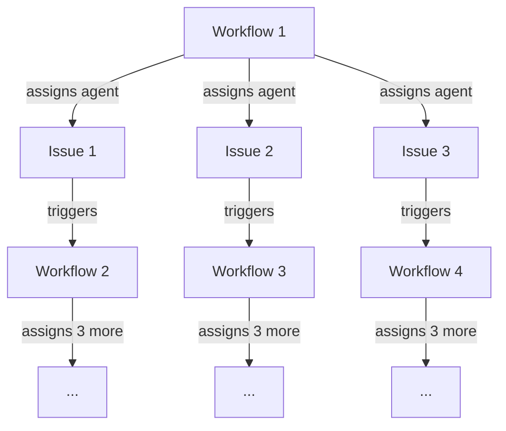
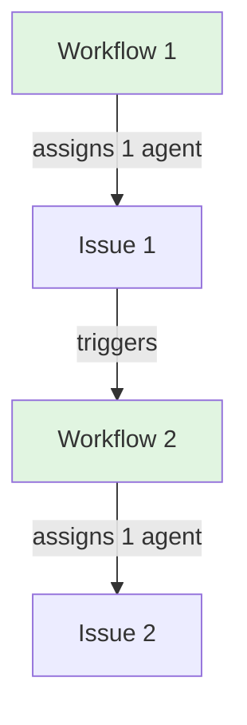
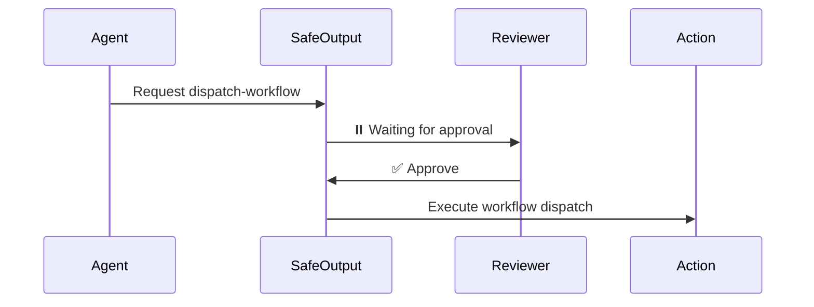

GitHub Agentic Workflows includes multiple layers of protection to prevent runaway workflows and exponential growth patterns. These controls work together to ensure safe, predictable execution even with autonomous agents.

## Overview of Protection Layers

The system employs defense-in-depth with multiple independent controls:

1. **Bot non-triggering** - Prevents cascading workflow chains
2. **Concurrency controls** - Serializes execution to prevent parallel explosions
3. **Timeouts** - Hard limits on execution time
4. **Rate limiting** - Throttles workflow trigger frequency per user
5. **Read-only agents** - Prevents direct write access
6. **Safe output limits** - Caps automated operations
7. **Built-in delays** - Rate-limits high-risk operations
8. **Manual review gates** - Optional human oversight for critical actions

## Bot Non-Triggering Behavior

The GitHub Actions bot account (`github-actions[bot]`) does **not trigger workflow events** when creating or modifying issues, pull requests, or comments. This prevents cascading chains where one workflow triggers another indefinitely.

**How it works:**

```yaml wrap
on:
  issues:
    types: [opened, edited]
  issue_comment:
    types: [created]
```

When a workflow with these triggers creates an issue or posts a comment via safe outputs, those actions do **not** trigger new workflow runs. This breaks potential infinite loops at the source.

**Example scenario prevented:**
1. Workflow A creates an issue via `create-issue`
2. Issue creation does **not** trigger Workflow B (even with `on: issues`)
3. Chain stops automatically

> [!NOTE]
> This is a built-in GitHub Actions behavior, not specific to gh-aw. The bot account is explicitly excluded from triggering workflows to prevent automation loops.

## Concurrency Groups

Workflows use **two levels of concurrency control** to prevent parallel execution explosions:

### Per-Workflow Concurrency

Each workflow execution is placed in a concurrency group based on its context:

```yaml wrap
concurrency:
  group: gh-aw-${{ github.workflow }}
  cancel-in-progress: false
```

The actual concurrency group pattern varies based on trigger type (includes issue numbers, PR numbers, or branch refs). See [Concurrency Control](/gh-aw/reference/concurrency/) for specific patterns.

**Benefits:**
- Prevents multiple simultaneous runs for the same context
- Queues work sequentially instead of running in parallel
- Avoids race conditions and duplicate operations

### Per-Engine Concurrency

Agent jobs use a second concurrency group based on the AI engine:

```yaml wrap
jobs:
  agent:
    concurrency:
      group: gh-aw-copilot
      cancel-in-progress: false
```

**Benefits:**
- Only one agent job runs at a time per engine
- Prevents AI resource exhaustion
- Ensures predictable token usage
- Avoids overwhelming external AI services

> [!TIP]
> See [Concurrency Control](/gh-aw/reference/concurrency/) for detailed configuration options and customization.

## Job Timeouts

Every job has a **maximum execution time** to prevent indefinite running:

### Workflow-Level Timeout

Default timeout for all jobs:

```yaml wrap
jobs:
  agent:
    timeout-minutes: 360  # 6 hours default
```

### Agent Job Timeout

The agent job (where AI reasoning occurs) has a configurable timeout:

```yaml wrap
---
engine:
  id: copilot
  timeout: 60  # Minutes (default: 360)
---
```

**Protection provided:**
- Agent cannot run indefinitely even if stuck
- Automatic cancellation after timeout
- Prevents cost overruns from hung processes
- Resource cleanup guaranteed

### Stop-After Field

Additional control for workflow runtime limits:

```yaml wrap
---
stop-after: +48h  # Stop workflow after 48 hours
---
```

**How it works:**
- Evaluated in the agent job's `if:` condition
- Compares current time against workflow start time
- Automatically skips execution if time limit exceeded
- Minimum unit is hours (`+1h`, `+24h`, `+48h`)

**Example:**

```yaml wrap
---
name: Long-Running Analysis
on:
  schedule:
    - cron: '0 0 * * *'  # Daily
stop-after: +6h
---

Analysis workflow that automatically stops if not 
completed within 6 hours of the scheduled trigger time.
```

> [!NOTE]
> The `stop-after` field is checked in the generated workflow action and prevents execution if exceeded, ensuring workflows don't continue beyond their intended window.

## Read-Only Agent Tokens

Agents run with **read-only GitHub tokens** by default. They cannot directly:
- Create or modify issues
- Update pull requests
- Post comments
- Change repository settings
- Trigger other workflows

**Token scope:**

```yaml wrap
permissions:
  contents: read          # Read code only
  issues: read           # Read issues only
  pull-requests: read    # Read PRs only
```

All write operations must go through the **safe outputs system**, which provides validation, auditing, and rate limiting.

## Safe Outputs Rate Limiting

The [safe outputs system](/gh-aw/reference/safe-outputs/) provides write capabilities with built-in limits. High-risk operations have **default maximums** to prevent exponential growth:

### Default Maximum Limits

| Operation | Default Max | Purpose |
|-----------|-------------|---------|
| `assign-to-agent` | **1** | Prevent agent spawn cascades |
| `assign-to-bot` | **1** | Prevent bot assignment loops |
| `dispatch-workflow` | **1** | Prevent workflow trigger explosions |
| `create-issue` | **1** | Limit automated issue creation |
| `create-pull-request` | **1** | Limit automated PR creation |

**Example configuration:**

```yaml wrap
safe-outputs:
  assign-to-agent:
    # Default max: 1 (can be increased if needed)
    max: 3  # Allow up to 3 agent assignments
  
  dispatch-workflow:
    # Default max: 1 (prevents cascading triggers)
    max: 2  # Allow triggering 2 workflows
```

### Why These Limits Matter

**Without limits:**


**With default max: 1:**


Linear growth instead of exponential explosion.

## Built-In Delays

Critical operations include **mandatory delays** to prevent burst patterns:

### Agent Assignment Delay

When assigning agents to multiple issues, a **10-second delay** occurs between assignments:

```javascript
// From assign_copilot_to_created_issues.cjs
if (i < issueEntries.length - 1) {
  core.info("Waiting 10 seconds before processing next agent assignment...");
  await sleep(10000);
}
```

**Protection:**
- Prevents spawning many agents simultaneously
- Gives each agent time to start before next assignment
- Reduces API burst load
- Allows monitoring and cancellation if needed

### Workflow Dispatch Delay

Workflow dispatches have a **5-second delay** between triggers:

```javascript
// From dispatch_workflow.cjs
if (lastDispatchTime > 0) {
  const timeSinceLastDispatch = Date.now() - lastDispatchTime;
  const delayNeeded = 5000 - timeSinceLastDispatch;
  if (delayNeeded > 0) {
    core.info(`Waiting ${Math.ceil(delayNeeded / 1000)} seconds before next dispatch...`);
    await new Promise(resolve => setTimeout(resolve, delayNeeded));
  }
}
```

**Protection:**
- Prevents rapid-fire workflow triggering
- Spreads load over time
- Allows cancellation window
- Reduces GitHub API pressure

> [!IMPORTANT]
> These delays are **hardcoded** in the safe outputs implementation and cannot be disabled. They are essential safety features.

## Manual Review with GitHub Environments

For sensitive operations, you can require **manual approval** before execution using GitHub Environments:

```yaml wrap
safe-outputs:
  dispatch-workflow:
    environment: production  # Requires approval
    max: 3
```

**Configuration steps:**

1. Create an environment in your repository (Settings → Environments)
2. Add required reviewers
3. Reference the environment in safe output configuration

**Approval flow:**



**Benefits:**
- Human oversight for critical operations
- Audit trail of approvals
- Ability to reject risky actions
- Compliance with change management policies

> [!TIP]
> Use environments for operations like:
> - Production workflow dispatches
> - Cross-repository operations
> - Bulk issue/PR creation
> - Security-sensitive actions

## Rate Limiting Per User

The `rate-limit:` configuration (see [RATE_LIMITING.md](https://github.com/github/gh-aw/blob/main/docs/RATE_LIMITING.md)) prevents individual users from triggering workflows too frequently:

```yaml wrap
---
rate-limit:
  max: 5        # Maximum runs per window
  window: 60    # Time window in minutes
---
```

**How it works:**
1. Pre-activation job checks recent workflow runs
2. Counts runs by the same user within time window
3. Cancels current run if limit exceeded
4. Prevents both accidental and intentional abuse

**Example protection:**

```yaml wrap
---
name: Expensive Analysis
on:
  issue_comment:
    types: [created]
rate-limit:
  max: 3
  window: 60
---
```

User cannot trigger more than 3 analysis runs per hour, even by posting multiple comments.

## Combined Protection Example

Here's how multiple layers work together:

```yaml wrap
---
name: Safe Agent Workflow
engine:
  id: copilot
  timeout: 60              # 1 hour max
  concurrency:
    group: gh-aw-copilot   # One at a time
on:
  issues:
    types: [opened]
rate-limit:
  max: 5                   # 5 per hour per user
  window: 60
stop-after: +2h            # Stop after 2 hours
safe-outputs:
  assign-to-agent:
    max: 1                 # Only 1 agent assignment
    environment: production # Requires approval
---

This workflow has multiple safety layers:
- Rate limited per user
- Concurrency controlled
- Time limited
- Manual approval required
- Single agent assignment only
```

**Protection layers:**
1. ✅ User can trigger max 5 times/hour (rate-limit)
2. ✅ Only 1 workflow runs at a time (concurrency)
3. ✅ Workflow stops after 2 hours (stop-after)
4. ✅ Agent job limited to 60 minutes (timeout)
5. ✅ Manual approval needed for agent assignment (environment)
6. ✅ Max 1 agent assigned (safe output limit)
7. ✅ 10-second delay before assignment (built-in)
8. ✅ Agent creation won't trigger new workflows (bot non-triggering)

## Best Practices

### Start Conservative

Begin with strict limits and relax as needed:

```yaml wrap
# Initial configuration - very safe
safe-outputs:
  assign-to-agent:
    max: 1  # Start with 1
  dispatch-workflow:
    max: 1  # Start with 1

rate-limit:
  max: 3  # Low frequency
  window: 60
```

Monitor behavior, then increase limits if justified.

### Use Environments for High-Risk Operations

Require manual approval for operations that:
- Trigger other workflows
- Create many resources
- Cross repository boundaries
- Affect production systems

### Monitor and Audit

Regularly review:
- Workflow run history
- Safe output execution logs
- Rate limit cancellations
- Timeout occurrences

Look for patterns indicating configuration adjustments needed.

### Layer Controls

Don't rely on a single protection mechanism. Use multiple:
- Rate limiting **AND** concurrency control
- Timeouts **AND** stop-after
- Safe output limits **AND** environments

Defense-in-depth ensures reliability.

## Troubleshooting

### Workflows Not Running

**Symptom:** Workflow run immediately cancelled

**Check:**
1. Rate limit exceeded? Look for "rate limit" in pre-activation logs
2. Concurrency queue full? Check other running workflows
3. Stop-after time exceeded? Verify workflow start time

### Agent Assignments Slow

**Symptom:** Multiple agent assignments take longer than expected

**Explanation:** Built-in 10-second delays are working as designed. If assigning 5 agents, expect ~40 seconds total (4 delays).

**This is intentional** to prevent overwhelming the system.

### Workflow Dispatch Not Triggering

**Symptom:** dispatch-workflow safe output runs but target workflow doesn't start

**Check:**
1. Max dispatch limit (default: 1) - only first dispatch succeeds
2. 5-second delay between dispatches
3. Target workflow `on: workflow_dispatch` configuration
4. Environment approval still pending

## Related Documentation

- [Safe Outputs](/gh-aw/reference/safe-outputs/) - Write operations with validation
- [Concurrency Control](/gh-aw/reference/concurrency/) - Execution serialization
- [Frontmatter Reference](/gh-aw/reference/frontmatter/) - Complete configuration options
- [Permissions](/gh-aw/reference/permissions/) - Token scopes and access control
- [GitHub Actions Security](https://docs.github.com/en/actions/security-guides) - GitHub's security guidance
