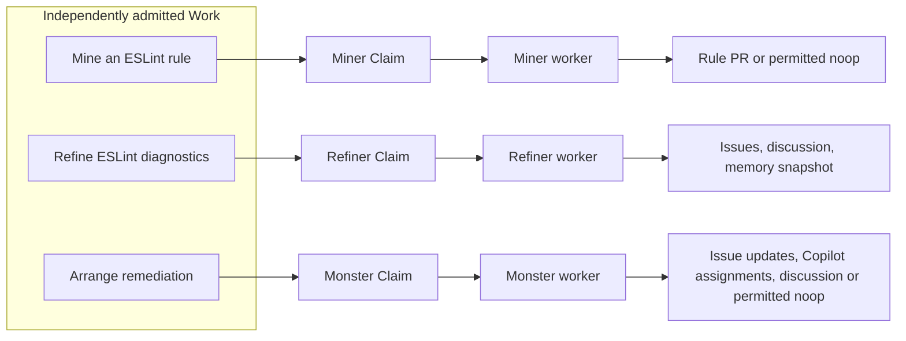
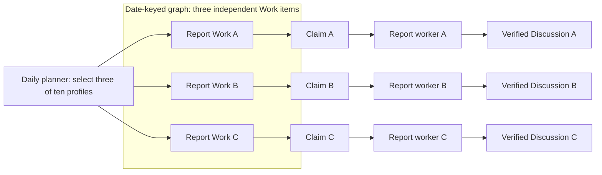

Work queues can be Git-backed or issue-backed. Native `tools.work-queue` uses
Git storage. Lightweight issue checklists and sub-issue queues use
[WorkQueueOps](/gh-aw/patterns/workqueue-ops/) with GitHub read tools and safe
outputs. This reference describes the native version-3 protocol. Git is the only
backend, and `tools.work-queue` has no `storage` field.

The native queue enforces fair scheduling, immutable task dependency graphs,
and worker effects authorized by individual Claims. Its only source of
authority is `work-queue.jsonl`, a transaction log that records events in causal
order. Defaults behave like first in, first out (FIFO): one priority, one
accounting key, and the oldest eligible Work first. Accounting keys group tasks
for fairness accounting. Configured weights share opportunities to receive
durable Claims, not CPU time or successful completions.

In the native protocol, issues and pull requests can be dependency nodes, but
cannot store the queue. Optional backing Issues mirror admitted Work; they do
not grant Claim authority or establish Result. [WorkQueueOps](/gh-aw/patterns/workqueue-ops/) describes
issue checklists, sub-issues, cache-memory, and repo-memory as alternatives, but those
progress markers do not provide native fair scheduling, Claim authority, or
verified dependency graphs.

The native protocol distinguishes the following records and lifecycle events:

| Term | Meaning |
| --- | --- |
| Work | An immutable task definition. Tasks can form a directed acyclic graph (DAG), a dependency graph with no cycles. |
| Claim | Authorization for one attempt at a Work item. Its original `claim_handle` identifies that attempt. |
| Policy | Administrator-installed rules for scheduling, producer permissions, worker routing, and limits. |
| Pool | A group of tasks with shared worker routes and capacity limits. |
| Reservation | Native worker capacity held for an assignment, including while launch or termination is uncertain. |
| Native launch | The request to start a GitHub Actions worker run. A committed assignment is not proof of launch. |
| Completion | A durable record of task completion, published before the Claim's effects. It is not proof of delivery. |
| Result | A record published only after independently verified delivery of the Claim's effects. |
| Release | The operation that frees a native reservation after trusted evidence of exact termination or definitive nonlaunch. |
| IssueLink | An immutable, checked link from one admitted Work item to one backing Issue. |
| IssueComment | An immutable canonical summary or historical Claim-comment handle. |

See [deployment](/gh-aw/guides/deploy-work-queue/) for Policy installation, the
[specification](/gh-aw/specs/work-queue-specification/) for normative behavior and
implementation coverage, and the
[formal verification reference](https://github.com/github/gh-aw/blob/main/specs/work-queue/README.md)
for executable models, contracts and reproduction instructions.

For workflow examples, see the [Linter Factory](/gh-aw/patterns/linter-factory/)
for fair dispatch and Claim-scoped worker outputs, and the
[Daily Report Portfolio](/gh-aw/patterns/daily-report-portfolio/) for a daily
dispatcher coordinating reporting workers.

## Backing Issues

```aw
tools:
  work-queue:
    worker: true
    issues:
      label: cookie
```

`issues: true` enables projection with the `work` tracking label and a
`work:<status>` label. An object may override `label` (for example, `cookie`
produces `cookie:queued`); an empty object uses defaults. Absent or false
disables the integration. The label prefix must be a nonblank literal of at
most 33 bytes, leaving room for the longest status suffix within GitHub's
50-character label limit; unknown keys are rejected.

Status labels are created as needed in the target repository with purple
(`7057FF`). Statuses use lowercase, hyphenated names with no spaces (for
example, `work:queued` and `work:needs-review`); whitespace in a configured
prefix is replaced with hyphens. The projector replaces only its own status
labels, preserving unrelated labels. No organization Issue field or Project
is required.

The existing activation and conclusion jobs project only Work admitted by
their authenticated run/attempt and Work in their original authenticated Claims.
Installed `Policy.projectors` rules must authorize the exact principal, workflow
revision, pool, and backing repository. Pre-existing Issues also require
explicit lossless identities in that rule's `backing_issues` array. A shared queue, workflow name, label,
API token, or caller-supplied Work ID does not grant scope. Agent execution
stages intents and receives no projector or queue-writer credential.
Conclusion refreshes checked Git state after queue settlement, including when
earlier jobs fail. Staged/trial projection performs no live queue or Issue writes.

An immutable submission node may specify `backing_issue`, using the same
lossless resource identity shape as an external dependency:

```json
{
  "kind": "issue",
  "host": "github.com",
  "repository": "owner/repo",
  "repository_id": "123",
  "resource_id": "456",
  "number": "7"
}
```

This property is separate from `subject`, effect scope, and dependencies.
Admission rejects pre-existing Issues without an installed exact-target grant;
each projecting workflow must independently hold that grant. Repository
allowlisting, marker text, and a generated summary do not establish ownership.
Without it, the hook creates an Issue and publishes its checked `IssueLink`.
Admission and link publication enforce one Work per Issue under concurrency;
links and comment handles cannot be rebound. The configured tracking label is
created if missing and repaired when removed. Human titles, bodies, types,
unrelated labels/fields, and discussion are preserved.

Each backing Issue has a canonical summary and one historical comment per
owned Claim, with run, ledger, and verified outcome links. Summaries include
changing status alongside its label. Completion projects **Verifying**, verified PR delivery **Needs review**,
and verified non-PR delivery **Done**. Native job failure/cancellation is
diagnostic, not Work cancellation or Result. Human closure/status changes
cannot establish either.

Generated Issue bodies, summaries, and Claim comments use the packaged
`actions/setup/md/work_queue_issue_*.md` templates and always include a
generated-by footer linking the producing run. Existing human Issue bodies
are not replaced.

Both protected hooks request `contents: write`, `issues: write`, and
`actions: read`, including separately minted projector App tokens. Agent
execution does not receive those write credentials. Issue creation uses the
shared `withRetry` helper only for a proven pre-execution rate-limit rejection;
timeouts and partial or ambiguous mutation responses are not blindly retried.

Issues stay open by default. An administrator may set a projector rule's
`"completion_policy": "close-on-result"` before Work admission; closure still
requires a verified non-PR Result and current target authority. Later policy
expansion cannot retroactively authorize closure. Agent payload fields,
including `issue_completion_policy`, never control closure. PR delivery alone
never authorizes closure.

### Synchronization and recovery

Short per-Work/per-Issue coordination spans fresh checked reads and native
writes without holding agents. Projection journals persist native creation
intent and verified receipts; bindings are batched through
`createCommitOnBranch` with `expectedHeadOid`. Publication conflicts refresh
and replay the ledger; uncertain acknowledgements recover stable requests.
Maintenance does not change Claims, fairness, reservations, or recovery reserve.

Only a later authorized hook for the same Work/Claims can retry pending
synchronization. There are no Issue intake scans, global dirty-Work sweeps,
schedules, or independent repair workflows. Transferred/deleted Issues,
deleted immutable comments, exhausted pagination, and uncertain creation remain
explicitly pending. Marker text or bot identity is not proof of creation.
Ambiguous native writes retain coordination: locks never expire or get stolen,
and absent verified receipts never authorize blind recreation.

Creation intent is durable before sending either an Issue or comment mutation.
An interruption before sending and a crash after GitHub accepted the write but
before saving its receipt are indistinguishable to the next hook. Both remain
pending, potentially indefinitely; a later hook alone cannot unblock a retained
lock or prove that an unreceipted creation never happened. Recording a
`sent` flag after the call would permit duplicates in that second crash window.
GitHub does not provide documented creation deduplication, and marker text or an
empty discovery result is not proof of noncreation. Automatic crash recovery
that can safely clear these fences is not implemented.

Hooks batch up to 25 owned targets. Checked GraphQL reads combine immutable-head
ledger/journal reads, label discovery, and scoped Issue preflight; an explicitly
truncated blob uses an OID-checked REST fallback. Writes are paced and exhausted
rate limits stop subsequent live requests. Hook metrics count authentication,
coordination, native writes, journals, and retries within the projection phase;
shared activation work and GitHub App token minting are additional requests.
Local full-hook mocks also count ordinary queue publication and both hooks.
For 25 unchanged existing Issues, the authenticated projection currently uses
seven requests: five reads and two batched coordination mutations, with no Issue
writes. An ordinary checked queue read/publication takes two requests instead
of the previous five/nine-call REST paths.
Mutation primary cost remains unmeasured; baseline Issue-operation estimates
must not be mistaken for this end-to-end total.

Upgrade every Go/JavaScript reader, compiler, runtime setup action, and operator
deployment before installing `projectors` or enabling new backing-Issue records.
The protocol remains version 3, but older closed-schema readers reject these
extensions. Existing logs need no migration; no automatic reader upgrade or
fallback to an older deployment is supported.

## Runtime debug logging

The JavaScript runtime uses the shared logger framework to write opt-in,
timestamped debug events to stderr. `DEBUG=work-queue:*` enables all queue
namespaces. `DEBUG=work-queue:store,work-queue:dispatch` selects components;
`DEBUG=work-queue:*,-work-queue:replay` excludes replay events. Namespace
patterns support `*`, with comma or whitespace separators.
`ACTIONS_RUNNER_DEBUG=true` or `RUNNER_DEBUG=1` enables all queue events,
including when a GitHub Actions run is re-run with debug logging.

Namespaces cover `store`, `replay`, `scheduler`, `native`, `dispatch`,
`reconciler`, `claims`, `delivery`, `effects`, `memory`, `intents`, and `mcp`. Events describe
publication attempts, conflicts, recovery, capacity and packing limits,
native launch and binding, independent verification, and durable settlement.
Metadata contains only counts, flags, retry delays, and HTTP status codes.
Payloads, identifiers, repository names, paths, URLs, tokens, raw API responses,
error messages, and stack traces are not logged. Debug events do not grant
authority or replace durable queue receipts.

## Workflow roles and intent tools

`tools.work-queue` gives the agent an immutable snapshot of the queue at
activation. The trusted compiler and runtime establish the workflow's role.
The agent cannot grant itself authority through snapshot metadata or files it
creates. In this reference, *trusted processing* means queue operations
performed by the runtime or authorized operator, rather than by the agent.

| Role | Behavior |
| --- | --- |
| Observer | Can read and explain the queue and use normally authorized reports or `noop`. Cannot submit, dispatch, or finish Work. |
| Producer/dispatcher | Stages task plans within producer permissions and requests assignments within pool and budget limits. Trusted processing refreshes the log, selects tasks by Policy, and commits the next fair group of assignments atomically. |
| Worker | Requires a version-3 Claim array. Trusted activation authenticates the actual run, workflow, and revision before authorizing effects for each Claim. |

A declared worker with missing assignment input fails; it does not become an
observer. An absent queue can be reported as uninitialized. An existing log
that is empty, malformed, or unsupported produces an explicit error, not an
empty backlog. A dispatcher without a worker assignment can control the queue
only within its authority; this does not authorize arbitrary resource writes.

| MCP tool | Purpose |
| --- | --- |
| `work_queue_read`, `work_queue_explain` | Inspect the immutable snapshot. Predictions may be stale; sorting changes only the display order. |
| `work_queue_submit` | Stage immutable task or graph plans within size limits and installed producer permissions. |
| `work_queue_dispatch_next` | Request the next assignments from a pool, within a specified limit. The scheduler selects the Work and target. |
| `work_queue_claim_finish` | Stage a `completed` or `cancelled` finish intent for an original Claim. |

When `<mcp-clis>` lists the runtime wrapper, the invocation is
`work-queue work_queue_read '{}'`. These subcommands are Model Context Protocol
(MCP) tools available to the agent, not `gh aw work-queue` operator commands.

### Claim-scoped effects and delivery

The compiler supplies the reserved `work_queue_assignment` input and caller
context. Assignment input alone does not authorize effects (changes made by
safe outputs), and a rerun cannot inherit attempt 1's authority.

Every safe output and finish intent belongs to one original Claim. The
`claim_handle` selector identifies that Claim. Only an originally single-Claim
assignment can omit it. Multi-Claim assignments require the original
`claim_handle` on every message, even when only one member remains open.
Malformed, null, foreign, or conflicting selectors fail.

Each Claim finishes independently with `outcome: "completed"` or `"cancelled"`.
A missing finish intent does not authorize effects. Assignments contain one
Claim by default. Batching multiple Claims is enabled only for compatible Work
that can reuse substantial setup.

Staging a finish intent does not make it durable. Trusted processing publishes
Completion before authorizing that Claim's effects and publishes Result only
after independently verified delivery. Completion is not Result.

A predecessor is a dependency that must be satisfied before a task can run.
An issue predecessor needs fresh evidence that it is completed; a pull request
predecessor needs evidence that it was actually merged. These nodes consume no
Claims. Work waits for its own predecessors' Results, not for the overall
worker run to conclude.

A lost launch response, dispatcher cancellation, or elapsed deadline does not
prove that a worker never launched. Cancellation does not stop a native worker
or release its reservation. Reservations remain until exact termination or
definitive nonlaunch evidence exists; reconciliation processes that evidence
separately. If delivery is uncertain after Completion, effects are not rerun.
Verification within configured bounds produces Result or DeliveryFailure, an
explicit terminal delivery failure.

### Diagnostic artifacts

Audit exports for each Claim contain executed operations, temporary-ID
references, and structured errors. They do not contain raw handler output and
are not proof of Result. Exports use private directories and files, redact
secrets from decoded fields, and default to one-day retention. Final uploads
fail closed: if redaction fails, the upload does not proceed. Protected
in-memory verification evidence remains separate, and the unused on-disk
delivery receipt is removed.

Only queue workers receive the upload paths and final redaction step.
Repository references are not anonymized. Opaque masks registered only in the
safe-output job cannot be recovered from agent logs. See
[Claim diagnostic artifacts](/gh-aw/patterns/daily-report-portfolio/#claim-diagnostic-artifacts)
for file purposes and redaction limits.

## Operator commands

`gh aw work-queue` defaults to branch `work-queue` and supports Git storage only.
`--repo owner/repo` selects the repository. An explicit `--branch` selects a
separate authoritative queue; it does not migrate an existing queue.

The CLI and workflow runtime share the QueueCommit contract (the fixed
transaction format and allowed record types) and scheduling rules. Independent
test fixtures check both implementations. Access failures, malformed logs, and
unsupported versions produce explicit errors. Commands do not silently
initialize Policy over an invalid log.

| Command | Purpose |
| --- | --- |
| `replay`, `stats` | Inspect state reconstructed from the log, typed dependency nodes, individual Claims, and native reservations. |
| `state [--graph GRAPH] [--pool POOL] [--state STATE] [--search TEXT]` | Display an ASCII tree of graphs, Work, and Claims using metadata only. `--offset` and `--limit` paginate at most 256 rows/64 KiB. |
| `inspect --work-id ID` or `inspect --claim-id ID` | Show full copyable IDs, dependency cross-references, current and historical ownership, original assignment membership, and separate delivery and native-run barriers. |
| `tui` (alias `interactive`) | Browse the queue with a keyboard, search, multi-select, and view details for the focused item. Review cancellation and future priority changes before publishing. |
| `explain --pool POOL [--work-id ID]` | Evaluate scheduler selection or inspect a dependency path without changing scheduling counters. |
| `explain --request-id ID` or `explain --claim-id ID` | Reconstruct an exact historical grant from the authoritative log up to that point. |
| `trace --request-id ID` or `trace --claim-id ID` | Read causal events within size limits, without exposing payloads or receipt contents. `--offset` and `--limit` control pagination. |
| `compact` | Replace the current log prefix with a version-3 checkpoint of deterministic replay state. The checkpoint names the prior Git commit and preserves fairness accounting, ownership, delivery barriers, and request identities. |
| `policy --file policy.json --epoch EPOCH` | Install an authorized Policy for future work only when the queue is quiescent. |
| `submit-work --file work.json` | Admit an immutable payload with default priority 3 and shared accounting key `""`, subject to installed producer permissions. |
| `submit-graph` | Atomically admit a normalized graph within size limits, including issue and pull request dependency nodes. |
| `dispatch-next --pool POOL --max-claims N --max-dispatches N` | Commit the next assignments selected by deterministic fair scheduling and their reservations. Does not send a workflow-dispatch POST. |
| `control`, `cancel-work` | Apply authorized pause, cutover, or cancellation decisions without refunding accounted service or force-releasing a reservation for a possible native run. |
| `cancel-claim --claim-id ID[,ID...] --reason CODE` | Atomically revoke the exact current Claims' authority and terminally cancel their Work. Does not retry work, impersonate a worker, or stop a native run. |
| `reprioritize --work-id ID[,ID...] --priority 1..5 --reason CODE` | Apply an administrator-only, compare-and-set priority override to future grants of available Work. Preserves admitted definitions, FIFO positions, retry boundaries, and accumulated fairness charges. |
| `evidence`, `reconcile --dispatch-id ID` | Inspect authenticated run evidence and reconcile exact termination. Uncertainty retains reserved capacity. |

`--json` returns structured output where supported. `--request-id` identifies
the same logical publication across retries. Each command's `--help`
describes validated inputs. Reservation, native launch, verified run binding,
Completion, Result, and Release are distinct; successful `dispatch-next` is
not proof of launch.

A Policy update requires a quiescent queue: no nonterminal (unfinished) Work,
outstanding reservations, or unresolved delivery barriers for completed Work.
Installing Policy does not configure or verify queue-branch writer restrictions.
Those restrictions must be established independently; automated enforcement
remains deferred. The agent cannot install Policy or receive queue-write
credentials.

Worker finish is a Claim-scoped MCP intent, not an operator command that can
impersonate a worker. Direct `claim --work-id`, legacy scalar assignments
(including agent-selected winners), Issues storage, old records, automatic
upgrades, and arbitrary run-ID adoption are unsupported by the native protocol.
Before deploying the current protocol, quiesce old writers and workflows and
preserve their evidence. Permissions to change the queue and trusted run
evidence must be established independently. An operator actor string does not
authorize a worker.

### Keyboard browser and checked actions

```bash
gh aw work-queue --repo owner/repo tui
gh aw work-queue --repo owner/repo state --json --limit 80
gh aw work-queue --repo owner/repo cancel-claim \
  --claim-id CLAIM_A,CLAIM_B --reason operator_cancelled --request-id incident-cancel
gh aw work-queue --repo owner/repo reprioritize \
  --work-id WORK_A,WORK_B --priority 1 --reason operator_reprioritized --request-id incident-priority
```

The terminal user interface (TUI) requires interactive standard input and
output and a terminal at least 45 columns wide by 16 rows high. At 100 columns,
it shows the tree beside details for the focused item. In narrower terminals,
`Tab` or `Enter` switches panes. Scrollable details show full IDs; list labels
abbreviate them. Text markers indicate selection and focus, so these states do
not depend on color alone.

| Key | Action |
| --- | --- |
| Arrows or `j`/`k`, `PgUp`/`PgDn`, `g`/`G` | Navigate Work and Claim attempts |
| Left/right or `h`/`l` | Collapse/expand Claim history |
| `Tab`/`Enter` | Focus details; arrows/page keys scroll that pane |
| `/`, then `Enter` | Apply a case-insensitive ID/metadata search |
| `Space` | Toggle multi-selection, including selections hidden by search |
| `c`, `p` | Review cancellation or select priority 1..5; `y` publishes, `n`/`Esc` dismisses |
| `r`, `?`, `q` | Refresh, keyboard help, quit |
| `Esc` outside a dialog | Clear search and selection |

The view refreshes every 10 seconds while idle. Search and action review pause
automatic reads. Each action shows its authority and exact targets. It cannot
publish if all targets do not fit in the confirmation view. Each TUI action
generates a stable request ID; `tui` rejects `--json` and `--request-id`.
Uncertain acknowledgments remain visible for inspection with
`explain --request-id`. If a read fails, the previous view remains visible with
an explicit stale or error status.

The tree groups graph membership and Claim attempts, not dependencies.
Details show cross-references for shared Work dependencies and issue or pull
request gates. Neither view displays payloads or receipt bodies.
`replay --json` provides the full authoritative state reconstructed from the
log.

Cancellation and reprioritization accept repeated selector flags or
comma-separated IDs. Both require an administrator and publish one checked,
all-or-nothing transaction. Compare-and-set (CAS) checks ensure that the
target's state has not changed before publication. A Claim selector includes
a durable ownership fence: a check tied to the exact owner, so refreshing
after a conflict cannot cancel a replacement owner. Completed ownership cannot
be cancelled, and historical Claims cannot cancel a new attempt.

Cancellation preserves dispatch membership, fairness charges, and native
reservations. It does not stop the native worker or free reserved capacity.
Exact termination or definitive nonlaunch evidence requires separate
reconciliation.

Priority overrides apply only to available Work, including Work waiting for a
retry. They do not change active assignments, admitted metadata, defaults for
child Work admission, fairness weights, or prior charges. Configured weights
determine each priority class's share. Defaults favor lower priority numbers
but do not guarantee strict priority ordering. If another grant or priority
change makes an action stale, the action is rejected rather than applied to a
different target.

Go and JavaScript protocol tests cover these administrator extensions. The
existing fixed-priority TLA+ models do not model arbitrary operator
reprioritization.

## Workflow examples

### Linter Factory

The [Linter Factory](/gh-aw/patterns/linter-factory/) routes eligible Work to
three worker profiles. This diagram shows the default singleton assignment
shape: one original Claim per Work item and worker assignment. The profiles
are not an automatic miner-to-refiner-to-monster dependency chain.



Each worker attributes its outputs and finish intent to its original Claim.
Outputs depend on the installed contract; trusted processing publishes
Completion before delivery and Result only after independent verification.
Compatible multi-Claim batching requires explicit Policy.

### Daily Report Portfolio

The [Daily Report Portfolio](/gh-aw/patterns/daily-report-portfolio/) admits
three of ten reporting profiles per daily activation. The three Work items
share a date-keyed graph but are independent roots, with no dependency edges
between them.



The diagram illustrates successful singleton assignments, not guaranteed
launches or publications. The dispatcher requests at most three Claims and
three dispatches; the native scheduler selects eligible Work from fresh queue
state, so older cohorts may win first. Each Discussion belongs to its worker's
original Claim and requires independently verified delivery before Result.
